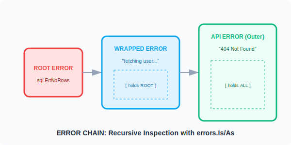

# CH-01: Error Wrapping (The Chain)

> **"Wrapping isn't just adding a prefix to a string; it's building a linked list of contexts that can be unwrapped and inspected."**

---

## 1. Tahap 1: Source Alignments & Judul
- **Source Link**: [Go Blog: Working with Errors in Go 1.13](https://go.dev/blog/go1.13-errors)
- **Status**: [x] Platinum Gold Standard

---

## 2. Tahap 2: Konsep & Esensi

### Definisi ("Apa itu?")
**Error Wrapping** adalah mekanisme untuk menyisipkan sebuah error ke dalam error lain (membentuk rantai) sambil menambahkan informasi konteks tambahan. Sejak Go 1.13, ini dilakukan menggunakan kata kunci `%w` dalam `fmt.Errorf`.

### Rasionalitas ("Why & How?")
- **Contextual Debugging**: Anda mendapatkan gambaran utuh dari mana error berasal (misal: "API Error" -> "Database Error" -> "Connection Timeout").
- **Preserve Identity**: Meskipun dibungkus dengan teks baru, identitas asli error (Sentinel Error) tetap terjaga. Anda masih bisa bertanya: "Apakah error ini sebenarnya adalah 'Not Found'?" meskipun teksnya sudah berubah.
- **Programmatic Inspection**: Alih-alih melakukan *String Matching* (yang sangat rapuh), kita menggunakan fungsi standar `errors.Is` dan `errors.As` untuk mendeteksi tipe error di sepanjang rantai.

### Analogi Model Mental
**Mata Boneka Matryoshka**.
Root Error adalah boneka terkecil di tengah. Lapisan luar (Wrapped Error) menambahkan baju dan aksesoris baru (Context). Meskipun Anda melihat boneka besar dari luar, di dalamnya tetap ada boneka asli yang sama. Go memberikan kita "X-Ray" (`errors.Is`) untuk melihat boneka di lapisan paling dalam.

### Terminologi Teknis
- **Sentinel Error**: Error konstan yang digunakan sebagai penanda (misal `sql.ErrNoRows`).
- **Unwrap()**: Method yang harus dimiliki oleh sebuah wrapped error agar rantai bisa ditelusuri.
- **errors.Is**: Mengecek apakah sebuah error ada di dalam rantai (berdasarkan nilai/identitas).
- **errors.As**: Mengecek apakah sebuah error ada di dalam rantai (berdasarkan tipe data kustom) dan mengekstraknya.

---

## 3. Tahap 3: Visualisasi Sistem

### The Error Chain (Matryoshka Concept)

---

## 4. Tahap 4: Mekanisme Pembuktian (%w vs %v)

Kapan harus membungkus?
- **Use `%w`**: Jika Anda ingin pemanggil fungsi (*caller*) bisa mendeteksi error aslinya menggunakan `errors.Is/As`. Ini mengekspos detail implementasi ke pemanggil.
- **Use `%v`**: Jika Anda ingin menyembunyikan detail implementasi. Ini akan "memutus" rantai; pemanggil hanya akan mendapatkan teksnya saja tanpa bisa melakukan unwrap.
- **The Golden Rule**: Jangan sembarangan menggunakan `%w` pada error eksternal yang tipenya bisa berubah di masa depan, karena itu akan menciptakan ketergantungan API yang ketat (*tightly coupled*).

---

## 5. Tahap 5: Multi-file Lab Praktis (Examples)

Menguasai inspeksi rantai error.

- **Lab 1**: [01_error_wrapping.go](./examples/01_error_wrapping.go) - Teknik membungkus dan mendeteksi Sentinel Error.
- **Lab 2**: [02_error_extraction.go](./examples/02_error_extraction.go) - Menggunakan `errors.As` untuk mengambil data dari custom error struct.

---
*Status: [x] Complete (Gold Standard - PPM V4)*
