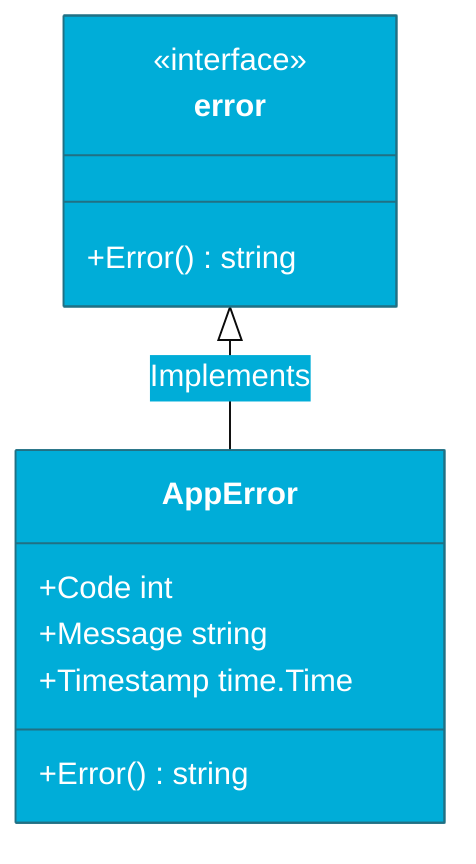

# CH-02: Custom Errors (Beyond Strings)

> **"Errors in Go are not just strings; they are first-class citizens that can carry state, logic, and context."**

---

## 1. Tahap 1: Source Alignments & Judul
- **Source Link**: [Go Spec: Errors](https://go.dev/ref/spec#Errors)
- **Status**: [x] Platinum Gold Standard

---

## 2. Tahap 2: Konsep & Esensi

### Definisi ("Apa itu?")
**Custom Errors** adalah pembuatan tipe data baru (biasanya `struct`) yang mengimplementasikan interface `error` bawaan Go. Ini memungkinkan kita melampirkan informasi tambahan selain pesan teks, seperti kode status HTTP, ID transaksi, atau waktu kejadian.

### Rasionalitas ("Why & How?")
- **Rich Metadata**: String error seringkali tidak cukup untuk logika program. Dengan struct, sistem bisa memutuskan perilaku berdasarkan *Error Code* (misal: "Jika error code 429, tunggu 5 detik").
- **Domain-Specific**: Anda bisa membuat "bahasa error" sendiri di dalam aplikasi Anda (misal: `ValidationError`, `AuthError`, `DatabaseError`).
- **Interoperability**: Karena tetap mengimplementasikan method `Error() string`, custom error Anda tetap bisa digunakan di mana pun interface `error` diminta (logging, return value, dll).

### Analogi Model Mental
**Lampu Indikator Mobil**.
- Standar Error: Lampu "Check Engine" menyala. Anda tahu ada masalah, tapi tidak tahu apa.
- Custom Error: Layar diagnostik muncul dan memberi tahu Anda: "Tekanan ban rendah (Code: P012), Lokasi: Kanan Depan (Metadata)". Anda mendapatkan konteks yang tepat untuk mengambil tindakan.

### Terminologi Teknis
- **error Interface**: Interface sederhana dengan satu method: `Error() string`.
- **Value Semantics**: Biasanya custom error dilempar sebagai pointer (`*MyError`) agar bisa diubah dan dibandingkan dengan mudah.

---

## 3. Tahap 3: Visualisasi Sistem

### Custom Error Struct Layout

---

## 4. Tahap 4: Mekanisme Pembuktian (Method Implementation)

Bagaimana cara membuat custom error yang sempurna?
- **Implement `Error()`**: Wajib. Ini adalah syarat agar struct Anda dianggap sebagai `error`.
- **Implement `Is()` & `As()`**: Opsional tapi sangat disarankan. Dengan menambahkan method ini, Anda bisa mengontrol bagaimana `errors.Is` dan `errors.As` berperilaku terhadap struct Anda (misal: menganggap dua error sama jika kodenya sama, meskipun pesan teksnya berbeda).
- **Pointer Receiver**: Selalu gunakan pointer receiver untuk method `Error()` pada struct agar konsisten dengan cara Go menangani error di library standar.

---

## 5. Tahap 5: Multi-file Lab Praktis (Examples)

Mendesain tipe error industri.

- **Lab 1**: [01_validation_error.go](./examples/01_validation_error.go) - Membuat error yang menampung daftar field yang tidak valid.
- **Lab 2**: [02_error_behavior.go](./examples/02_error_behavior.go) - Menambahkan logic kustom ke dalam error untuk mendeteksi perilaku (e.g. IsRetryable).

---
*Status: [x] Complete (Gold Standard - PPM V4)*
