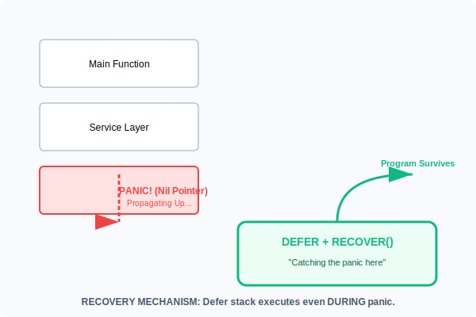

# CH-03: Safety Net (Defer, Panic & Recover)

> **"Panic is for unrecoverable errors. Recover is your last line of defense. Defer is your promise to clean up."**

---

## 1. Tahap 1: Source Alignments & Judul
- **Source Link**: [Go Blog: Defer, Panic, and Recover](https://go.dev/blog/defer-panic-and-recover)
- **Status**: [x] Platinum Gold Standard

---

## 2. Tahap 2: Konsep & Esensi

### Definisi ("Apa itu?")
**The Safety Net** adalah kumpulan mekanisme kontrol aliran di Go untuk menangani situasi luar biasa. 
- **Defer**: Menunda eksekusi fungsi hingga fungsi saat ini berakhir.
- **Panic**: Menghentikan aliran program normal dan mulai memanjat (*winding up*) tumpukan panggilan (*call stack*).
- **Recover**: Fungsi bawaan yang bisa menghentikan proses panic dan mengambil alih kendali (hanya berfungsi di dalam `defer`).

### Rasionalitas ("Why & How?")
- **Resource Management**: Dengan `defer`, Anda bisa memastikan file ditutup atau koneksi database dilepas tepat setelah dibuka, mengurangi risiko *Memory Leak*.
- **Fault Tolerance**: Dalam server web, satu request yang menyebabkan crash tidak boleh mematikan seluruh server. `recover` memungkinkan kita menangkap crash tersebut dan memberikan respon error yang sopan kepada user.
- **Clean Syntax**: Alih-alih menulis banyak blok try-catch yang bersarang, Go menggunakan `defer` untuk menjaga logika utama tetap "bersih" di bagian atas.

### Analogi Model Mental
**Penyelamatan di Gedung (Stack)**.
`Panic` adalah kebakaran di lantai 3. Api akan merambat naik ke lantai 4, 5, dan seterusnya hingga seluruh gedung runtuh (App Crash). `Recover` adalah regu pemadam yang sudah stand-by di tangga darurat (`Defer`). Mereka menangkap api tersebut dan memadamkannya, sehingga lantai di atasnya tetap aman.

### Terminologi Teknis
- **LIFO (Last In First Out)**: Urutan eksekusi `defer`. Yang terakhir didaftarkan akan dijalankan pertama kali.
- **Runtime Panic**: Panic yang dipicu secara otomatis oleh Go (misal: mengakses index array di luar batas).

---

## 3. Tahap 3: Visualisasi Sistem

### Panic & Recovery Mechanism

---

## 4. Tahap 4: Mekanisme Pembuktian (Graceful Exit)

Kapan harus menggunakan Panic?
- **Initialization**: Saat aplikasi dijalankan dan file konfigurasi penting hilang. Lebih baik mati (*Panic*) daripada hidup dalam kondisi tidak konsisten.
- **Logic Bugs**: Situasi yang seharusnya "mustahil" terjadi jika kode benar.
- **Don't use for regular errors**: Jangan gunakan panic untuk file non-exist atau input user yang salah. Gunakan tipe `error` biasa.

Aturan Emas `Recover`:
- Harus dipanggil di dalam fungsi yang di-`defer`.
- Hanya menangkap panic dalam *Goroutine* yang sama. Panic di goroutine lain tidak bisa ditangkap oleh recover di goroutine main.

---

## 5. Tahap 5: Multi-file Lab Praktis (Examples)

Manajemen siklus hidup aplikasi yang aman.

- **Lab 1**: [01_defer_cleanup.go](./examples/01_defer_cleanup.go) - Mengelola resource dengan aman dan urutan LIFO.
- **Lab 2**: [02_panic_recovery.go](./examples/02_panic_recovery.go) - Membangun middleware sederhana untuk menangkap crash.

---
*Status: [x] Complete (Gold Standard - PPM V4)*
