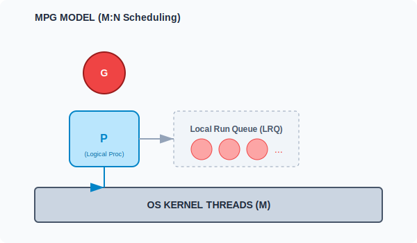

# CH-01: The Go Routine (The Engine)

> **"Goroutines are not threads. They are light multiplexed onto threads. Thousands of them can live in a single application with minimal overhead."**

---

## 1. Tahap 1: Source Alignments & Judul
- **Source Link**: [Go Runtime: Scheduler](https://go.dev/src/runtime/proc.go)
- **Status**: [x] Platinum Gold Standard

---

## 2. Tahap 2: Konsep & Esensi

### Definisi ("Apa itu?")
**Goroutine** adalah fungsi yang dijalankan secara konkuren (bersamaan) dengan fungsi lainnya. Berbeda dengan Thread OS yang dikelola oleh Kernel, Goroutine dikelola oleh **Go Runtime Scheduler**.

### Rasionalitas ("Why & How?")
- **Lightweight**: Thread OS biasanya memakan memori ~1-2 MB untuk stack-nya. Goroutine hanya butuh ~2 KB saat inisialisasi. Ini memungkinkan kita menjalankan puluhan ribu Goroutine dalam satu laptop biasa.
- **Dynamic Stack**: Stack Goroutine bisa tumbuh dan menyusut sesuai kebutuhan, sedangkan stack Thread OS ukurannya tetap (*fixed*).
- **Context Switching**: Mengganti eksekusi antar Thread OS sangat mahal (harus masuk ke Kernel). Mengganti antar Goroutine sangat murah karena terjadi di level User-space oleh Go Scheduler.

### Senior Insight: Stack Evolution
Dulu (sebelum Go 1.3), Go menggunakan **Segmented Stacks** (seperti rantai blok memori). Namun, ini menyebabkan masalah "Hot Split" (performa drop jika fungsi dipanggil tepat di batas segment). Sekarang, Go menggunakan **Stack Copying**: jika stack penuh, Go mengalokasikan stack baru yang 2x lebih besar dan *menyalin* seluruh data ke sana. Ini jauh lebih efisien untuk cache CPU.

### Analogi Model Mental
**Koki di Restoran Besar**.
- Thread OS: Kompor gas. Jumlahnya terbatas (misal cuma 8).
- Goroutine: Pesanan pelanggan (tikets). Koki (Scheduler) bisa menangani puluhan pesanan secara bergantian di atas 8 kompor tersebut. Jika satu pesanan sedang menunggu air mendidih (Blocking I/O), koki langsung pindah mengerjakan pesanan lain di kompor yang sama tanpa harus mematikan kompor tersebut.

### Terminologi Teknis
- **M (Machine)**: Representasi Thread OS asli.
- **P (Processor)**: Resource yang dibutuhkan untuk menjalankan kode Go (Logical Context). Jumlahnya dikontrol oleh `GOMAXPROCS`.
- **G (Goroutine)**: Unit eksekusi terkecil (kode Anda).

---

## 3. Tahap 3: Visualisasi Sistem

### MPG Model (M:N Scheduling)

---

## 4. Tahap 4: Mekanisme Pembuktian (Scheduling Strategies)

Bagaimana Go Scheduler mengelola ribuan G di atas sedikit M?
- **Work Stealing**: Jika satu Processor (P) kehabisan tugas, dia akan mencuri tugas dari antrean Processor lain agar semua core CPU tetap sibuk.
- **Asynchronous Preemption (Go 1.14+)**: Dulu, Goroutine hanya bisa diberhentikan jika melakukan pemanggilan fungsi (titik aman). Sekarang, Go bisa menginterupsi Goroutine di mana saja (misal: loop matematika yang sangat padat) menggunakan sinyal OS, mencegah satu goroutine "membajak" seluruh core CPU.
- **Syscall Handling**: Jika sebuah Goroutine melakukan I/O yang memblokir, M akan dilepas dan Go akan membuat/mengambil M baru untuk menjalankan Goroutine lain, sehingga P tidak terhenti.

---

## 5. Tahap 5: Multi-file Lab Praktis (Examples)

Membuktikan ringannya Goroutine.

- **Lab 1**: [01_goroutine_mass.go](./examples/01_goroutine_mass.go) - Menjalankan 100.000 goroutines dan memantau penggunaan memori.
- **Lab 2**: [02_sequential_vs_concurrent.go](./examples/02_sequential_vs_concurrent.go) - Perbandingan waktu eksekusi tugas berat.

---
*Status: [x] Complete (Gold Standard - PPM V4)*
