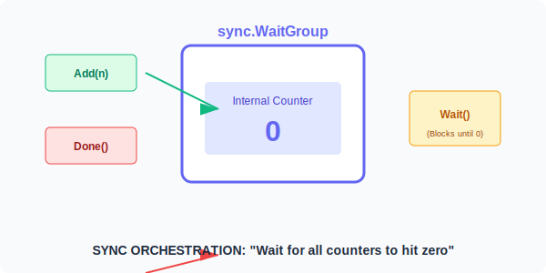

# CH-02: WaitGroups (The Coordinator)

> **"A WaitGroup waits for a collection of goroutines to finish. The main goroutine calls Add to set the number of goroutines to wait for, then each of the goroutines runs and calls Done when finished."**

---

## 1. Tahap 1: Source Alignments & Judul
- **Source Link**: [Go Standard Library: sync.WaitGroup](https://pkg.go.dev/sync#WaitGroup)
- **Status**: [x] Platinum Gold Standard

---

## 2. Tahap 2: Konsep & Esensi

### Definisi ("Apa itu?")
**sync.WaitGroup** adalah alat sinkronisasi primitif yang digunakan untuk menunda eksekusi sebuah fungsi (biasanya `main`) sampai sekelompok Goroutine yang berjalan secara konkuren selesai dieksekusi.

### Rasionalitas ("Why & How?")
- **Deterministic Ending**: Tanpa WaitGroup, fungsi `main` mungkin selesai lebih cepat daripada goroutine yang ia luncurkan, menyebabkan program berhenti secara prematur dan pekerjaan goroutine hilang.
- **Efficient Sleeping**: Alih-alih menggunakan `time.Sleep` yang menebak-nebak waktu (sangat tidak reliabel), WaitGroup memberikan kepastian mutlak berdasarkan penyelesaian tugas nyata.
- **Thread Safety**: WaitGroup diimplementasikan menggunakan operasi atomik sehingga aman digunakan oleh banyak goroutine sekaligus tanpa perlu kunci tambahan.

### Analogi Model Mental
**Absensi Guru di Kelas**.
Guru (Main Function) ingin pulang, tapi dia harus memastikan semua murid (Goroutines) sudah selesai mengumpulkan tugas.
1. Guru menghitung jumlah murid yang ada, misal 20 (`Add(20)`).
2. Murid mulai mengerjakan tugas secara paralel.
3. Saat satu murid selesai, dia menaruh tugas di meja guru dan melapor (`Done()`).
4. Guru berdiri di depan pintu menunggu (`Wait()`). Dia baru akan keluar gedung jika jumlah laporan yang ia terima sudah mencapai 20.

### Terminologi Teknis
- **Counter**: Angka internal yang menyimpan jumlah tugas yang tersisa.
- **Liveness**: Sifat program yang menjamin eksekusi akan terus berjalan atau berhenti dengan benar (WaitGroup mencegah *Deadlock* jika digunakan dengan benar).

---

## 3. Tahap 3: Visualisasi Sistem

### WaitGroup Internal Flow

---

## 4. Tahap 4: Mekanisme Pembuktian (The Golden Rules)

Kesalahan fatal yang sering dilakukan Senior:
- **Passing by Value**: WaitGroup **HARUS** dipasang sebagai pointer (`*sync.WaitGroup`) jika dikirimkan ke fungsi lain. Jika Anda mengirimkannya sebagai *value*, Go akan membuat salinan baru, dan `Done()` pada salinan tersebut tidak akan pernah mempengaruhi `Wait()` di aslinya (menyebabkan Deadlock).
- **Add outside the Loop**: Selalu panggil `wg.Add(1)` **SEBELUM** menjalankan `go func()`. Jika dipanggil di dalam goroutine, ada risiko `wg.Wait()` dijalankan lebih dulu sebelum `Add` sempat tereksekusi.
- **Panic Protection**: Gunakan `defer wg.Done()` di baris pertama goroutine untuk memastikan counter berkurang meskipun terjadi panic (CH-03 SR-06 connection).

### Senior Insight: The Memory Alignment
Di balik layar, `sync.WaitGroup` menggunakan state 64-bit (counter & waiter). Pada arsitektur 32-bit, Go melakukan trik khusus agar data ini selaras (*aligned*) di memori agar operasi atomik bisa bekerja. Inilah alasan mengapa Anda **tidak boleh menyalin** (copy) WaitGroup setelah digunakan: selain merusak logika, salinan tersebut mungkin tidak memiliki penyelarasan memori yang sama dengan aslinya, memicu bug yang sangat sulit dilacak.

### Traps to Watch
- **Negative Counter**: Jika Anda memanggil `Done()` lebih banyak daripada `Add()`, aplikasi akan **PANIC** seketika.
- **Reuse Trap**: Jangan memanggil `Add()` pada WaitGroup yang sama sementara `Wait()` dari penggunaan sebelumnya belum kembali (*returned*).

---

## 5. Tahap 5: Multi-file Lab Praktis (Examples)

Mengatur orkestra paralel.

- **Lab 1**: [01_multi_worker_sync.go](./examples/01_multi_worker_sync.go) - Sinkronisasi 10 worker yang bekerja bersamaan.
- **Lab 2**: [02_pointer_trap.go](./examples/02_pointer_trap.go) - Demonstrasi kesalahan fatal "Pass by Value" dan cara memperbaikinya.

---
*Status: [x] Complete (Gold Standard - PPM V4)*
