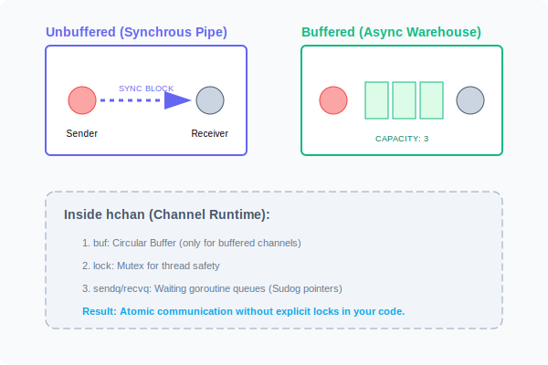

# CH-01: Channels & Buffering (The Pipes)

> **"A channel is a conduit through which you can send and receive values. It's the synchronization primitive that makes Go concurrency safe and intuitive."**

---

## 1. Tahap 1: Source Alignments & Judul
- **Source Link**: [Go Spec: Channel Types](https://go.dev/ref/spec#Channel_types)
- **Status**: [x] Platinum Gold Standard

---

## 2. Tahap 2: Konsep & Esensi

### Definisi ("Apa itu?")
**Channel** adalah tipe data di Go yang berfungsi sebagai media komunikasi antar Goroutine secara aman. Channel memungkinkan satu Goroutine mengirim data dan Goroutine lain menerimanya tanpa risiko *Data Race* karena Go menangani sinkronisasi di balik layar.

### Rasionalitas ("Why & How?")
- **Synchronization**: Channel bukan sekadar antrean data. Dia adalah alat sinkronisasi. Secara default, pengirim akan berhenti (*block*) sampai penerima siap, memastikan kedua belah pihak "bertemu" di titik yang sama.
- **Directional**: Kita bisa membatasi channel hanya untuk mengirim (`chan<-`) atau hanya untuk menerima (`<-chan`), membuat kontrak fungsi menjadi lebih aman dan protektif.
- **Safety**: Dibangun di atas struktur `hchan` di runtime, channel menggunakan mutex internal namun memberikan interface yang bersih tanpa lock eksplisit bagi pengembang.

### Senior Insight: The hchan Structure
Setiap channel di Go direpresentasikan oleh struct `hchan` di memori. Di dalamnya terdapat:
- **Circular Buffer**: Tempat data mengantre (hanya untuk buffered).
- **sendq & recvq**: Daftar *Sudog* (wrapper goroutine) yang sedang menunggu untuk mengirim atau menerima.
- **Lock**: Mutex tingkat rendah untuk memproteksi akses ke `hchan` itu sendiri.
Memahami ini membantu Anda sadar bahwa channel **bukanlah magic tanpa biaya**, melainkan abstraksi cerdas di atas lock dan memory copying.

### Analogi Model Mental
**Pipa Air vs Gudang**.
- **Unbuffered**: Seperti pipa air tanpa tangki. Air hanya bisa mengalir jika keran di ujung sana dibuka. Jika keran tertutup, tekanan air akan menahan aliran (Blocking).
- **Buffered**: Seperti pipa air dengan tangki penampung (Gudang). Anda bisa menuangkan air ke tangki meskipun keran belum dibuka, selama tangki belum penuh.

### Terminologi Teknis
- **Blocking**: Kondisi di mana Goroutine tertidur menunggu aksi dari sisi lain channel.
- **Deadlock**: Kondisi fatal di mana semua goroutine tertidur dan tidak ada yang bisa membangunkan (misal: mengirim ke channel yang tidak ada penerimanya).
- **hchan**: Struktur runtime asli yang mendasari sebuah channel.

---

## 3. Tahap 3: Visualisasi Sistem

### Unbuffered vs Buffered Channels

---

## 4. Tahap 4: Mekanisme Pembuktian (Channel Lifecycle)

Aturan kritis manajemen channel:
- **Send to Nil**: Mengirim ke channel `nil` akan menyebabkan **BLOCK SELAMANYA**.
- **Close a Nil/Closed Channel**: Menutup channel `nil` atau channel yang sudah tertutup akan menyebabkan **PANIC**.
- **Receive from Closed**: Menerima dari channel yang sudah ditutup akan mengembalikan *Zero Value* tipe datanya dan tidak akan memblokir. Gunakan `val, ok := <-ch` untuk memeriksa apakah channel masih terbuka.
- **Who Closes?**: Aturan umum: **Pengirim** (Producer) yang harus menutup channel, jangan pernah penerima yang menutupnya.

### Senior Insight: Buffer Size Wisdom
Jangan asal memberikan angka besar pada buffer.
- `cap = 0`: Sinkronisasi murni. Sangat aman tapi lambat.
- `cap = 1`: Memberikan sedikit ruang bernapas (decoupling) namun tetap menjaga kecepatan eksekusi yang hampir sekuensial.
- `cap = >100`: Berbahaya. Buffer besar seringkali menyembunyikan bug *Logical Bottleneck* atau *Memory Leak* yang seharusnya diselesaikan dengan menambah jumlah worker, bukan memperbesar gudang.

---

## 5. Tahap 5: Multi-file Lab Praktis (Examples)

Eksperimen aliran data.

- **Lab 1**: [01_unbuffered_handshake.go](./examples/01_unbuffered_handshake.go) - Demonstrasi sifat sinkron dari unbuffered channel.
- **Lab 2**: [02_buffered_decoupling.go](./examples/02_buffered_decoupling.go) - Menggunakan buffer untuk menangani lonjakan data (*Backpressure*).
- **Lab 3**: [03_range_close.go](./examples/03_range_close.go) - Iterasi elegan melalui channel menggunakan `range`.

---
*Status: [x] Complete (Gold Standard - PPM V4)*
