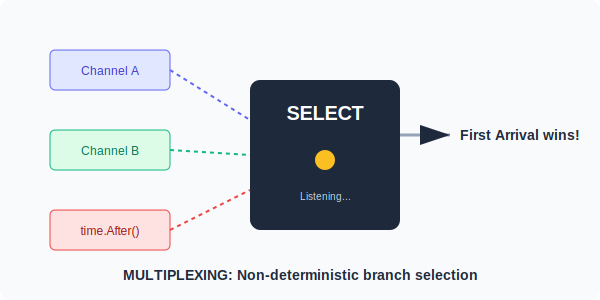

# CH-02: Select & Timeouts (The Switchboard)

> **"The select statement lets a goroutine wait on multiple communication operations. It's like a switch statement, but for channels."**

---

## 1. Tahap 1: Source Alignments & Judul
- **Source Link**: [Go Spec: Select statements](https://go.dev/ref/spec#Select_statements)
- **Status**: [x] Platinum Gold Standard

---

## 2. Tahap 2: Konsep & Esensi

### Definisi ("Apa itu?")
**Select** adalah struktur kontrol yang digunakan untuk menangani beberapa operasi channel secara bersamaan. Program akan memblokir (*block*) sampai salah satu *case* di dalam select siap dieksekusi. Jika ada beberapa yang siap secara bersamaan, Go akan memilih salah satu secara acak (*random choice*).

### Rasionalitas ("Why & How?")
- **Multiplexing**: Alih-alih menunggu satu per satu channel secara sekuensial (yang lambat), select memungkinkan Anda merespon channel mana pun yang mengirim data lebih dulu.
- **Timeouts**: Go tidak memiliki parameter "timeout" bawaan di channel. Kita mensimulasikannya menggunakan `select` bersama dengan `time.After(duration)`.
- **Non-blocking Communication**: Dengan menambahkan blok `default`, kita bisa mencoba mengirim atau menerima data tanpa harus memblokir jika channel tidak siap.

### Analogi Model Mental
**Resepsionis Hotel**.
Resepsionis (Select) duduk di depan 3 telepon (Channels).
1. Telepon A: Pesanan Makanan.
2. Telepon B: Keluhan Kamar.
3. Telepon C: Alarm Kebakaran (Timeout).
Dia tidak bisa menelepon duluan, dia hanya menunggu. Telepon mana pun yang berdering paling dulu, dialah yang akan dilayani. Jika telepon A dan B berdering bersamaan, dia memilih secara acak mana yang diangkat lebih dulu agar adil.

### Terminologi Teknis
- **Multiplexing**: Menggabungkan beberapa aliran input menjadi satu jalur output.
- **time.After**: Fungsi yang mengembalikan channel yang akan mengirim data setelah durasi tertentu.
- **Biased Select**: Pola di mana kita menginginkan prioritas tertentu (membutuhkan teknik khusus).

---

## 3. Tahap 3: Visualisasi Sistem

### Select Multiplexing Strategy

---

## 4. Tahap 4: Mekanisme Pembuktian (Reliability & Fairness)

Detail penting bagi Senior Engineer:
- **Random Selection**: Go secara sengaja memilih case secara acak jika banyak yang siap. Ini mencegah "Starvation" di mana satu channel mendominasi eksekusi terus menerus.
- **Empty Select**: Baris kode `select {}` akan menyebabkan goroutine **BLOCK SELAMANYA** tanpa memakan CPU. Sering digunakan di fungsi `main` aplikasi server agar tidak pernah berhenti.
- **Default for Non-blocking**: Blok `default` dijalankan seketika jika tidak ada channel yang siap. Jangan gunakan `default` di dalam loop tanpa `time.Sleep` kecuali Anda ingin CPU mencapai 100%.

---

## 5. Tahap 5: Multi-file Lab Praktis (Examples)

Orkestrasi waktu dan data.

- **Lab 1**: [01_basic_select.go](./examples/01_basic_select.go) - Menangani dua channel secara bersamaan.
- **Lab 2**: [02_api_timeout.go](./examples/02_api_timeout.go) - Simulasi pemanggilan API dengan batas waktu 2 detik.
- **Lab 3**: [03_non_blocking.go](./examples/03_non_blocking.go) - Menggunakan `default` untuk pengecekan channel instan.

---
*Status: [x] Complete (Gold Standard - PPM V4)*
