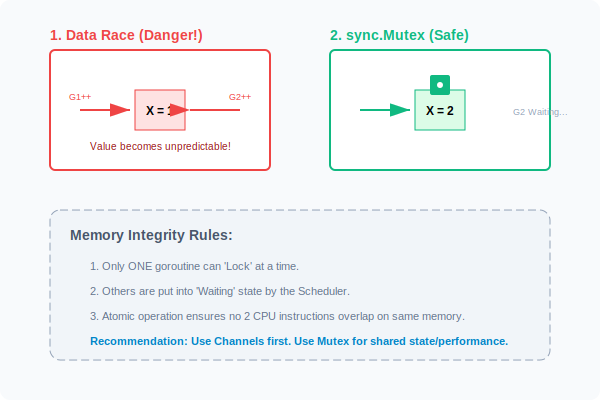

# CH-01: Data Race & Mutex (The Safety Guard)

> **"A data race occurs when two or more goroutines access the same memory location concurrently, and at least one of the accesses is a write."**

---

## 1. Tahap 1: Source Alignments & Judul
- **Source Link**: [Go Blog: Introducing the Go Race Detector](https://go.dev/blog/race-detector)
- **Status**: [x] Platinum Gold Standard

---

## 2. Tahap 2: Konsep & Esensi

### Definisi ("Apa itu?")
**Data Race** adalah bug konkurensi di mana dua goroutine mencoba memodifikasi data yang sama di saat yang bersamaan, menyebabkan nilai data menjadi rusak atau tidak terduga.
**sync.Mutex** (Mutual Exclusion) adalah alat yang digunakan untuk menjamin bahwa hanya satu goroutine yang dapat mengakses bagian kode tertentu (*Critical Section*) pada satu waktu.

### Rasionalitas ("Why & How?")
- **Shared State**: Meskipun Go menyarankan "Share memory by communicating" (Channels), terkadang menggunakan variabel bersama (*Shared State*) lebih efisien untuk performa tinggi atau cache database.
- **Memory Consistency**: Tanpa Mutex, operasi sederhana seperti `x++` (yang sebenarnya terdiri dari 3 instruksi CPU: Read, Increment, Write) bisa disisipi oleh goroutine lain di tengah-tengah instruksinya.
- **Determinism**: Mutex mengembalikan kepastian pada alur program paralel yang liar.

### Analogi Model Mental
**Satu Kamar Mandi di Kantor**.
- Goroutines: Karyawan.
- Variabel Bersama: Kamar mandi.
- Mutex: Kunci pintu.
Siapa pun yang ingin masuk harus memutar kunci (`Lock()`). Jika ada orang lain yang datang, dia harus menunggu di luar. Setelah selesai, kunci diputar kembali (`Unlock()`) sehingga orang berikutnya bisa masuk. Tanpa kunci, dua orang bisa masuk bersamaan dan terjadilah kekacauan (*Data Race*).

### Terminologi Teknis
- **Critical Section**: Bagian kode yang mengakses resource bersama.
- **Deadlock**: Kondisi di mana G1 menunggu G2, dan G2 menunggu G1 (semua terkunci selamanya).
- **Atomic Operations**: Operasi yang dijamin oleh hardware CPU tidak bisa disela.

---

## 3. Tahap 3: Visualisasi Sistem

### Race Condition vs sync.Mutex


---

## 4. Tahap 4: Mekanisme Pembuktian (The Tools of Trade)

Bagaimana cara mendeteksi Race Condition?
Go menyediakan alat bawaan yang sangat kuat: **Race Detector**.
Jalankan aplikasi Anda dengan flag `-race`:
```bash
go run -race main.go
```
Alat ini akan menganalisis akses memori saat runtime dan memberikan laporan mendalam jika terjadi tabrakan akses.

Urutan Emas Mutex:
1. `mu.Lock()`
2. `defer mu.Unlock()` (Selalu gunakan defer agar tidak lupa unlock jika terjadi panic atau return awal).
3. Kerjakan logika di *Critical Section*.

### Senior Insight: Starvation Mode (Go 1.9+)
Go memiliki dua mode untuk Mutex:
- **Normal Mode**: Kecepatan tinggi. Goroutine yang baru bangun seringkali menang memperebutkan lock melawan goroutine yang sudah antre lebih lama (karena CPU cache sudah panas).
- **Starvation Mode**: Jika sebuah goroutine menunggu lebih dari 1ms, Mutex pindah ke mode ini. Lock akan diberikan langsung ke goroutine yang paling lama mengantre. Ini menjaga **Fairness** (keadilan) agar tidak ada proses yang "kelaparan" selamanya, meskipun performa sedikit turun.

---

## 5. Tahap 5: Multi-file Lab Praktis (Examples)

Mendeteksi dan Memperbaiki Bahaya.

- **Lab 1**: [01_race_condition.go](./examples/01_race_condition.go) - Demonstrasi bug data race pada counter sederhana.
- **Lab 2**: [02_mutex_fix.go](./examples/02_mutex_fix.go) - Memperbaiki Lab 1 menggunakan `sync.Mutex`.
- **Lab 3**: [03_atomic_fix.go](./examples/03_atomic_fix.go) - Solusi performa tinggi untuk counter menggunakan package `sync/atomic`.

---
*Status: [x] Complete (Gold Standard - PPM V4)*
