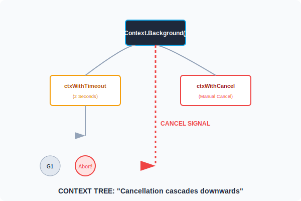

# CH-02: Context Pattern (The Termination Signal)

> **"In Go, the context package is the standard way to handle cancellation, timeouts, and request-scoped values across API boundaries and goroutines."**

---

## 1. Tahap 1: Source Alignments & Judul
- **Source Link**: [Go Blog: Go Concurrency Patterns: Context](https://go.dev/blog/context)
- **Status**: [x] Platinum Gold Standard

---

## 2. Tahap 2: Konsep & Esensi

### Definisi ("Apa itu?")
**context.Context** adalah interface di Go yang membawa sinyal pembatalan, batas waktu (deadline), dan nilai-nilai lain melintasi batas-batas API dan antar Goroutine. Ia berfungsi sebagai "Rem Darurat" yang bisa ditarik untuk menghentikan seluruh rantai proses yang tidak lagi dibutuhkan.

### Rasionalitas ("Why & How?")
- **Resource Leak Prevention**: Tanpa Context, sebuah Goroutine yang menjalankan query database selama 10 menit akan terus berjalan meskipun pengguna sudah menutup browsernya. Ini disebut *Goroutine Leak*.
- **Cascading Cancellation**: Saat sebuah Parent Context dibatalkan, semua Child Context yang diturunkan darinya otomatis ikut batal, menghentikan seluruh "pohon" pekerjaan secara efisien.
- **Unified Interface**: Memberikan cara yang seragam bagi library (database, http, grpc) untuk saling berkomunikasi tentang kapan harus berhenti bekerja.

### Analogi Model Mental
**Sinyal HT di Operasi Militer**.
Komandan (Main Context) memberikan instruksi ke tim lapangan (Child Context).
Tim lapangan membawa HT yang selalu stand-by mendengarkan sinyal: "Operasi Dibatalkan!".
Jika Komandan meneriakkan sinyal tersebut, semua tim, sub-tim, dan unit di bawahnya berhenti bergerak seketika. Mereka tidak perlu bertanya kenapa, cukup simpan senjata dan pulang (Graceful Exit).

### Terminologi Teknis
- **Done Function**: Channel `ctx.Done()` yang akan tertutup saat konteks dibatalkan.
- **Deadline**: Waktu absolut kapan sebuah pekerjaan harus selesai.
- **Propagation**: Aliran sinyal dari atas ke bawah dalam pohon hirarki konteks.

---

## 3. Tahap 3: Visualisasi Sistem

### Context Tree & Propagation


---

## 4. Tahap 4: Mekanisme Pembuktian (Usage Standards)

Aturan Emas bagi Software Architect:
- **Pass as First Argument**: Konteks harus menjadi parameter pertama dari sebuah fungsi: `func DoWork(ctx context.Context, ...)`.
- **Don't Store in Struct**: Jangan simpan Context di dalam tipe data Struct. Kirimkan secara eksplisit melalui fungsi agar siklus hidupnya jelas.
- **The Done Pattern**: Selalu periksa `ctx.Done()` di dalam loop yang berjalan lama atau operasi I/O:
  ```go
  select {
  case <-ctx.Done():
      return ctx.Err()
  case result := <-workCh:
      // proses hasil
  }
  ```
- **Context.Background()**: Hanya gunakan di entry-point aplikasi (seperti `main` atau inisialisasi test).

### Senior Insight: The Done Channel Closure
Mengapa Context sangat efisien dalam membatalkan ribuan goroutine sekaligus? Karena sinyal pembatalan bekerja dengan cara **menutup (close)** channel `ctx.Done()`. Di Go, menerima dari channel yang tertutup tidak akan memblokir dan mengembalikan sinyal instan. Inilah sebabnya satu `cancel()` bisa membangunkan ribuan `select` secara simultan tanpa overhead komunikasi satu-ke-satu.

---

## 5. Tahap 5: Multi-file Lab Praktis (Examples)

Mengelola siklus hidup proses.

- **Lab 1**: [01_manual_cancel.go](./examples/01_manual_cancel.go) - Menghentikan generator angka secara manual.
- **Lab 2**: [02_timeout_api.go](./examples/02_timeout_api.go) - Menggunakan `WithTimeout` untuk simulasi request HTTP yang aman.
- **Lab 3**: [03_context_value.go](./examples/03_context_value.go) - Mengirimkan metadata (Trace ID) melalui context.

---
*Status: [x] Complete (Gold Standard - PPM V4)*
