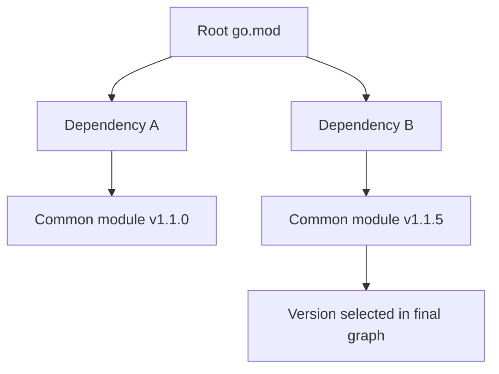

# CH-01: Anatomy of `go.mod` and `go.sum`

## 1. Tahap 1: Source Alignment dan Judul

- **Source Link**: [Using Go Modules](https://go.dev/blog/using-go-modules) | [Go Modules Reference](https://go.dev/ref/mod)
- **Framing**: `go.mod` dan `go.sum` adalah dua file inti yang membuat dependency workflow Go terasa eksplisit, bisa diaudit, dan bisa diulang dengan lebih aman.

## 2. Tahap 2: Konsep dan Rasionalitas

### Definisi
`go.mod` adalah manifest modul yang menyimpan identitas modul, versi Go, dan requirement dependency. `go.sum` adalah catatan checksum yang membantu memverifikasi integritas dependency yang pernah dipakai saat build.

### Rasionalitas
Mekanisme ini dipilih karena:

1. **Build jadi reproducible**  
   Tim tidak lagi bergantung pada isi lokal `$GOPATH` atau dependency yang kebetulan terpasang di mesin tertentu.
2. **Resolusi dependency lebih terukur**  
   Toolchain memakai aturan seperti Minimal Version Selection untuk menentukan graph dependency yang stabil.
3. **Integritas supply chain lebih terjaga**  
   Checksum membantu memastikan dependency yang diunduh cocok dengan catatan yang diharapkan.

### Analogi Model Mental
Bayangkan dapur profesional. `go.mod` adalah daftar bahan dan takaran resep, sementara `go.sum` adalah stempel pemeriksaan kualitas bahan yang memastikan isi paket yang datang memang sesuai dengan yang dipesan.

### Terminologi Teknis
- **Module Path**: identitas unik modul.
- **MVS (Minimal Version Selection)**: strategi Go untuk memilih versi dependency yang dipakai di graph final.
- **Checksum Database**: layanan verifikasi yang membantu memvalidasi integritas modul.

## 3. Tahap 3: Visualisasi Sistem

## 4. Tahap 4: Mekanisme Pembuktian

Saat `go build`, `go test`, atau `go mod tidy` dijalankan, toolchain membaca `go.mod`, menyusun requirement graph, lalu menentukan versi modul yang dipakai. Dependency yang diunduh akan dicek integritasnya terhadap `go.sum`.

Yang penting untuk `RAK-03`:
- module system adalah evolusi workflow engineering, bukan sekadar file konfigurasi;
- dependency diperlakukan sebagai graph yang eksplisit;
- integritas dependency menjadi bagian dari proses kerja, bukan tambahan opsional.

## 5. Tahap 5: Lab Praktis

Lihat pembuktian di folder [examples/](./examples):
- [01-mvs-simulation](./examples/01-mvs-simulation) - Simulasi pemilihan versi dependency dengan MVS.
- [02-checksum-fail](./examples/02-checksum-fail) - Eksperimen untuk melihat bagaimana checksum melindungi workflow modul.

---
*Status: [x] Complete*
