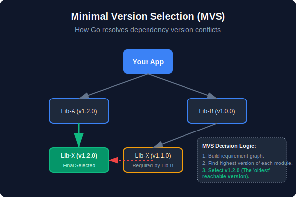
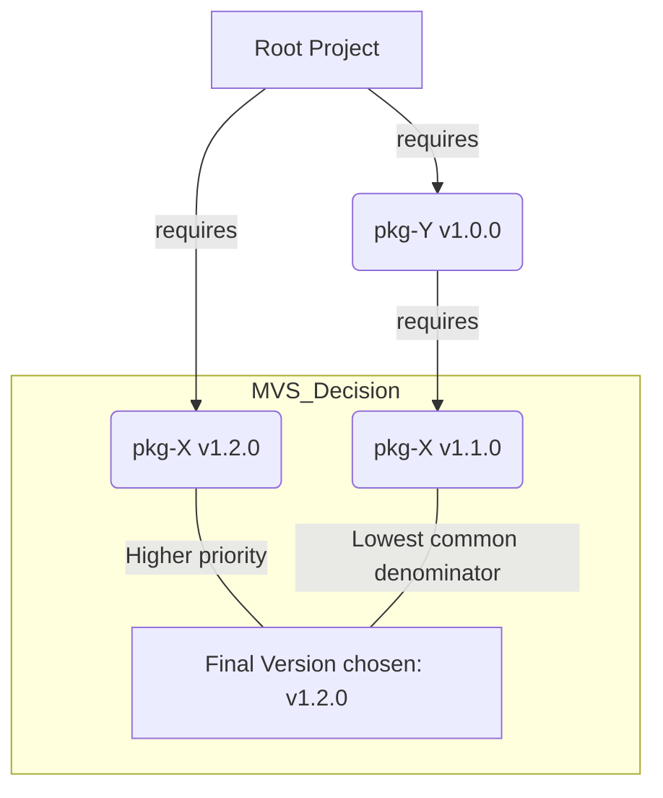

# [BK-01-CH-01] Anatomy of `go.mod` & `go.sum`

**The Dependency Manifest & Integrity Lock**
*Target: Memahami struktur, direktif, dan mekanisme keamanan di balik sistem manajemen paket Go dalam waktu < 4 menit.*

## 1. Definisi & Konsep (The Logic)

`go.mod` adalah manifest resmi yang mendefinisikan identitas modul, versi Go yang digunakan, dan grafik dependensi proyek. Sementara `go.sum` berfungsi sebagai *lock file* yang menyimpan *checksum* (SHA-256) dari semua dependensi untuk menjamin integritas dan keamanan supply chain.

### Terminologi Utama (Senior Terms)
- **MVS (Minimal Version Selection)**: Algoritma Go untuk memilih versi dependensi yang paling 'tua' namun memenuhi syarat minimum, guna menghindari *dependency hell*.
- **Module Path**: Identitas unik modul (biasanya URL repository).
- **Direct vs Indirect**: Dependensi yang diimpor langsung dalam kode vs dependensi dari dependensi (transitif).
- **Checksum DB (GOSUMDB)**: Database global untuk memvalidasi isi `go.sum`.

## 2. Rasionalitas (Why & How?)

Sebelum era Modul (pre-Go 1.11), Go bergantung pada `$GOPATH` dan `vendor/` yang rapuh terhadap perubahan versi. `go.mod` memperkenalkan **Reproducible Builds**.

### Mekanisme Kerja Under-the-Hood
1. **Resolution**: Saat Anda menjalankan `go build`, Go membaca `go.mod` dan membangun *Requirement Graph*.
2. **Verification**: Go mengunduh file `.zip` dan file `.mod` dari dependensi, lalu menghitung checksum-nya.
3. **Validation**: Checksum tersebut dibandingkan dengan `go.sum` lokal dan `GOSUMDB`. Jika tidak cocok, build gagal (mencegah *Man-in-the-Middle* atau modifikasi paket di server).

## 3. Implementasi Utama (The Lab)

Lihat pembuktian kode fungsional dan simulasi error di [examples/](./examples/).
1. `01-mvs-simulation`: Simulasi bagaimana Go memilih versi terendah yang kompatibel.
2. `02-checksum-fail`: Eksperimen sengaja merusak `go.sum` untuk melihat proteksi terminal.

## 4. Model Mental Visual (The Assets)

### MVS vs SemVer Resolution

---
*Back to [BK-01 Page](../README.md)*
