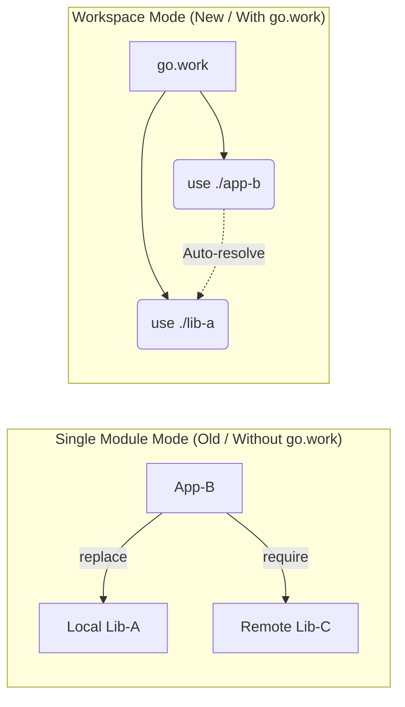

# [BK-01-CH-02] Workspace Workflow (`go.work`)

**Orchestrating Multi-Module Development**
*Target: Memahami manajemen pengembangan multi-repo secara lokal tanpa merusak file `go.mod` dalam waktu < 3 menit.*

## 1. Definisi & Konsep (The Logic)

`go.work` adalah file konfigurasi workspace yang diperkenalkan pada Go 1.18. Ia memungkinkan developer untuk mengerjakan beberapa modul dalam direktori yang berbeda secara bersamaan, di mana setiap modul dapat saling mereferensikan secara lokal tanpa perlu mengubah direktif `replace` di masing-masing file `go.mod`.

### Terminologi Utama (Senior Terms)
- **Workspace Mode**: Mode di mana variabel lingkungan `GOWORK` menunjuk ke file `go.work` yang valid.
- **`use` Directive**: Instruksi dalam `go.work` untuk menyertakan modul spesifik ke dalam workspace.
- **Main Module**: Modul utama tempat Anda menjalankan perintah Go; dalam workspace, semua modul `use` dianggap sebagai modul utama.

## 2. Rasionalitas (Why & How?)

Sebelum ada `go.work`, jika Anda ingin mengubah `Library-A` saat mengerjakan `App-B`, Anda harus:
1. Menambahkan `replace example.com/lib-a => ../lib-a` di `App-B/go.mod`.
2. **Bahaya**: Seringkali developer lupa menghapus `replace` ini sebelum melakukan *commit*, sehingga merusak build di CI/CD atau bagi developer lain.

### Mekanisme Kerja Under-the-Hood
Saat Go dijalankan dalam direktori yang memiliki `go.work` (atau di sub-direktorinya), Go akan:
- Menggabungkan semua modul yang ada di direktif `use` ke dalam satu **Workspace View**.
- Prioritas resolusi dependensi akan beralih ke folder lokal yang ada di workspace sebelum mencari di GOMODCACHE atau Proxy.

## 3. Implementasi Utama (The Lab)

Lihat pembuktian workspace fungsional di [examples/](./examples/).
1. `01-multi-module-sync`: Cara menghubungkan project aplikasi dengan library lokal secara seamless menggunakan `go work init` and `go work use`.

## 4. Model Mental Visual (The Assets)

### Workspace vs Single-Module Mode

---
*Back to [BK-01 Page](../README.md)*
