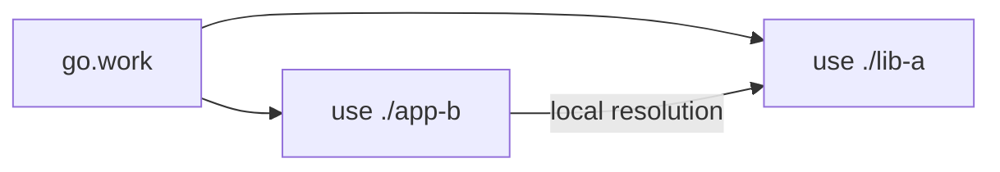

# CH-02: Workspace Workflow with `go.work`

## 1. Tahap 1: Source Alignment dan Judul

- **Source Link**: [Get familiar with workspaces](https://go.dev/doc/tutorial/workspaces) | [Go Modules Reference: Workspaces](https://go.dev/ref/mod#workspaces)
- **Framing**: `go.work` membuat pengembangan multi-module lokal jauh lebih rapi karena wiring antar modul tidak lagi perlu disisipkan sebagai `replace` sementara di setiap `go.mod`.

## 2. Tahap 2: Konsep dan Rasionalitas

### Definisi
`go.work` adalah file workspace yang menyatukan beberapa modul lokal ke dalam satu workspace view agar toolchain Go bisa memperlakukan semuanya sebagai bagian dari lingkungan kerja yang sama.

### Rasionalitas
Mekanisme ini dipilih karena:

1. **Pengembangan multi-module jadi lebih aman**  
   Developer tidak perlu bolak-balik menambah dan menghapus `replace` lokal di setiap modul.
2. **Kolaborasi lokal lebih bersih**  
   Library dan aplikasi bisa dikerjakan bersamaan tanpa mencemari metadata modul utama.
3. **Workflow lokal lebih dekat ke struktur nyata sistem**  
   Beberapa modul terkait bisa diuji bersama dalam satu ruang kerja yang eksplisit.

### Analogi Model Mental
Bayangkan satu meja kerja besar tempat beberapa prototipe diletakkan berdampingan. Selama semua prototipe ada di meja yang sama, teknisi bisa merangkainya bersama tanpa harus mengubah label permanen di tiap komponen.

### Terminologi Teknis
- **Workspace Mode**: mode ketika toolchain membaca `go.work`.
- **`use` Directive**: deklarasi modul yang dimasukkan ke workspace.
- **Workspace View**: pandangan gabungan terhadap beberapa modul lokal.

## 3. Tahap 3: Visualisasi Sistem

## 4. Tahap 4: Mekanisme Pembuktian

Saat `go.work` aktif, toolchain membentuk workspace view dari semua modul yang ada di directive `use`. Resolusi dependency akan memprioritaskan modul lokal yang ada di workspace sebelum jatuh ke cache atau proxy modul biasa.

Nilai evolusinya untuk `RAK-03`:
- workflow lokal menjadi bagian resmi dari toolchain;
- dependency antar modul bisa dikelola tanpa trik sementara yang mudah terlupa;
- pengembangan sistem multi-module jadi lebih dapat diprediksi.

## 5. Tahap 5: Lab Praktis

Lihat pembuktian workspace di folder [examples/](./examples):
- [01-multi-module-sync](./examples/01-multi-module-sync) - Contoh beberapa modul lokal yang disatukan dalam satu workspace menggunakan `go work`.

---
*Status: [x] Complete*
