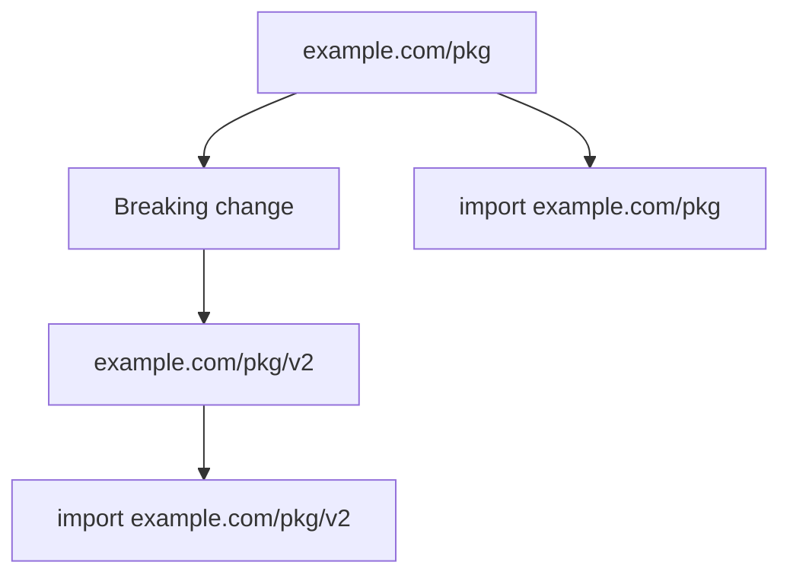

# CH-03: Semantic Versioning for `v2+`

## 1. Tahap 1: Source Alignment dan Judul

- **Source Link**: [Go Modules Reference: Major version suffixes](https://go.dev/ref/mod#major-version-suffixes) | [Publishing Go Modules](https://go.dev/blog/publishing-go-modules)
- **Framing**: Di Go, perubahan mayor bukan cuma soal angka versi. Untuk `v2+`, perubahan itu juga terlihat langsung di module path dan import path.

## 2. Tahap 2: Konsep dan Rasionalitas

### Definisi
Go mengikuti semantic versioning, tetapi untuk versi mayor `v2` dan seterusnya ada aturan tambahan: major version suffix harus muncul di module path, misalnya `example.com/lib/v2`.

### Rasionalitas
Aturan ini dipilih karena:

1. **Breaking change jadi eksplisit**  
   Pemakai library langsung melihat bahwa ada perubahan mayor saat import path ikut berubah.
2. **Versi mayor bisa hidup berdampingan**  
   Aplikasi dapat memakai `v1` dan `v2` dari library yang sama jika memang perlu.
3. **Kompatibilitas ekosistem lebih terjaga**  
   Upgrade mayor tidak diam-diam memecahkan kode orang lain tanpa sinyal yang jelas.

### Analogi Model Mental
Bayangkan gedung lama dan gedung baru milik institusi yang sama. Keduanya masih satu organisasi, tetapi alamatnya berbeda. Kalau alamat berubah, pengunjung tahu mereka sedang menuju bangunan generasi baru, bukan sekadar renovasi kecil.

### Terminologi Teknis
- **SemVer**: skema `major.minor.patch`.
- **Major Version Suffix**: suffix seperti `/v2` atau `/v3` pada module path.
- **Semantic Import Versioning**: praktik memasukkan versi mayor ke import path untuk `v2+`.

## 3. Tahap 3: Visualisasi Sistem

## 4. Tahap 4: Mekanisme Pembuktian

Untuk `v0` dan `v1`, module path tidak perlu suffix khusus. Namun mulai `v2`, `go.mod` dan import path harus menyertakan suffix versi mayor. Aturan ini membuat toolchain bisa membedakan major line yang berbeda sebagai dependency yang memang berbeda.

Yang penting untuk `RAK-03`:
- versioning diperlakukan sebagai bagian dari compatibility contract;
- perubahan mayor tidak hanya dicatat di release note, tetapi dipaksa terlihat di path;
- ekosistem modul Go lebih stabil karena breaking change dibuat eksplisit.

## 5. Tahap 5: Lab Praktis

Lihat contoh migrasi di folder [examples/](./examples):
- [01-v2-module-path](./examples/01-v2-module-path) - Demonstrasi perubahan module path dan import path saat modul naik ke `v2`.

---
*Status: [x] Complete*
