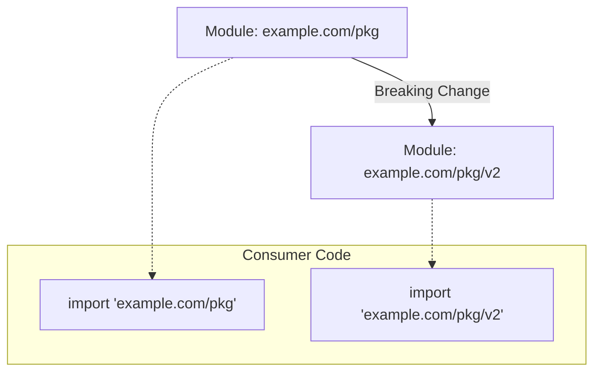

# [BK-01-CH-03] Semantic Versioning (v2+)

**The Import Path Compatibility Rule**
*Target: Memahami aturan emas versi Go dan cara melakukan upgrade major version tanpa merusak ekosistem dalam waktu < 4 menit.*

## 1. Definisi & Konsep (The Logic)

Go mengikuti prinsip **Semantic Versioning (SemVer)** dengan tambahan aturan ketat yang disebut **Import Path Compatibility Rule**. Aturan ini menyatakan bahwa jika paket mengubah jalur impornya, ia adalah paket yang berbeda. Untuk versi major `v2` ke atas, Go mengharuskan versi tersebut dicantumkan dalam *module path*.

### Terminologi Utama (Senior Terms)
- **SemVer (Major.Minor.Patch)**: Standar penomoran versi (Breaking.Feature.Fix).
- **Major Version Suffix**: Penambahan `/v2`, `/v3`, dst. pada akhir module path di `go.mod`.
- **Semantic Import Versioning**: Praktik menyertakan nomor versi major dalam string impor kode.

## 2. Rasionalitas (Why & How?)

Mengapa Go memaksa `/v2` di URL?
- **Diamond Dependency Problem**: Memungkinkan sebuah program menggunakan `v1` dan `v2` dari library yang sama secara bersamaan jika diperlukan (karena dianggap sebagai paket berbeda).
- **Explicit Breaking Changes**: Developer segera sadar bahwa ada perubahan drastis saat mereka harus mengubah string `import`.

### Mekanisme Kerja Under-the-Hood
1. **v0 & v1**: Tidak memerlukan suffix. `example.com/mod` dianggap v0 atau v1.
2. **v2+**: Module path harus menjadi `example.com/mod/v2`. File sistem di repository tidak harus memiliki folder `v2/` (bisa menggunakan *branch* atau *tag*), namun `go.mod` wajib mencantumkannya.

## 3. Implementasi Utama (The Lab)

Lihat teknik migrasi v2 di [examples/](./examples/).
1. `01-v2-module-path`: Cara meng-upgrade modul dari v1 ke v2 secara idiomatik.
2. `02-coexistence`: Simulasi aplikasi menggunakan `lib/v1` dan `lib/v2` sekaligus.

## 4. Model Mental Visual (The Assets)

### Upgrade Path v1 -> v2

---
*Back to [BK-01 Page](../README.md)*
