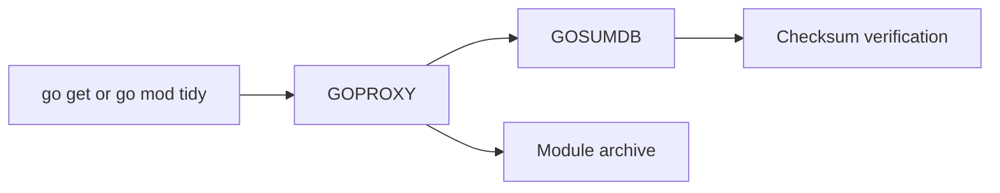

# CH-01: `GOPROXY` and `GOSUMDB`

## 1. Tahap 1: Source Alignment dan Judul

- **Source Link**: [Go Modules Reference: Environment variables](https://go.dev/ref/mod#environment-variables) | [Modules mirror, index, and checksum database](https://go.dev/ref/mod#module-proxy)
- **Framing**: Sistem modul Go bukan cuma soal Git repository. Ada lapisan distribusi dan verifikasi yang membuat dependency publik lebih stabil, cepat, dan lebih sulit dimanipulasi diam-diam.

## 2. Tahap 2: Konsep dan Rasionalitas

### Definisi
`GOPROXY` adalah mekanisme distribusi modul melalui proxy cache, sedangkan `GOSUMDB` adalah layanan verifikasi checksum yang membantu memastikan integritas modul yang diunduh.

### Rasionalitas
Mekanisme ini dipilih karena:

1. **Availability lebih baik**  
   Build tidak langsung bergantung pada server Git asli setiap saat.
2. **Distribusi lebih konsisten**  
   Proxy menyajikan artefak modul yang lebih stabil daripada mengandalkan clone VCS penuh berulang kali.
3. **Integritas lebih mudah diverifikasi**  
   Checksum membantu mendeteksi dependency yang berubah tidak semestinya.

### Analogi Model Mental
Bayangkan gudang logistik resmi dan pos pemeriksaan kualitas. Proxy berperan sebagai gudang distribusi yang menyimpan paket yang siap diambil, sedangkan sum database berperan sebagai pos validasi yang memastikan isi paket belum diganti di tengah jalan.

### Terminologi Teknis
- **`GOPROXY`**: daftar endpoint proxy modul.
- **`GOSUMDB`**: checksum database untuk verifikasi integritas modul publik.
- **Direct Mode**: fallback untuk mengambil modul langsung dari VCS.

## 3. Tahap 3: Visualisasi Sistem

## 4. Tahap 4: Mekanisme Pembuktian

Saat toolchain Go membutuhkan modul publik, ia biasanya mencoba proxy sesuai urutan di `GOPROXY`. Jika modul ditemukan, metadata dan arsip modul diambil dari sana. Setelah itu, checksum modul diverifikasi terhadap catatan yang relevan.

Nilai evolusinya untuk `RAK-03`:
- workflow dependency publik menjadi lebih terukur;
- distribusi modul tidak bergantung penuh pada ketersediaan VCS asli;
- integritas dependency ikut menjadi bagian dari alur kerja harian, bukan langkah terpisah.

## 5. Tahap 5: Lab Praktis

Lihat contoh alur kontrol proxy di folder [examples/](./examples):
- [01-proxy-control](./examples/01-proxy-control) - Eksperimen pengaturan mode proxy dan dampaknya pada resolusi modul.

---
*Status: [x] Complete*
