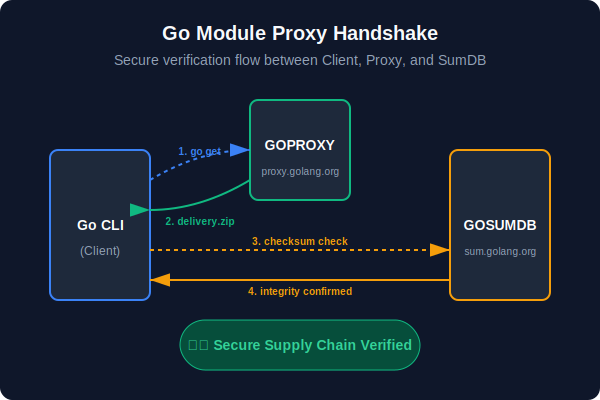
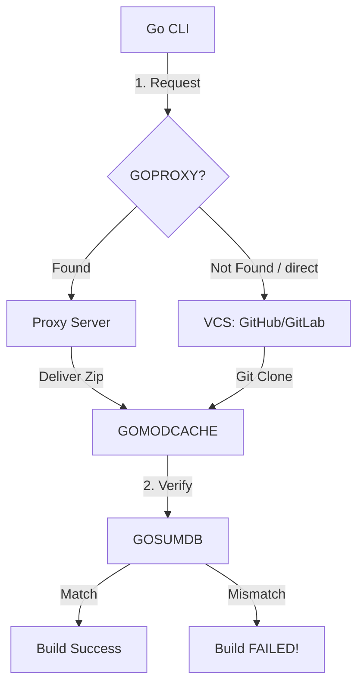

# [BK-02-CH-01] GOPROXY & GOSUMDB

**Infrastructure for Trusted Supply Chains**
*Target: Memahami infrastruktur distribusi modul Go dan mekanisme verifikasi integritas global dalam waktu < 4 menit.*

## 1. Definisi & Konsep (The Logic)

Sistem modul Go tidak hanya bergantung pada Git, tetapi pada jaringan **Proxy** dan **Checksum Database**. Ini memastikan bahwa modul yang Anda unduh hari ini akan tetap identik selamanya, bahkan jika penulis aslinya menghapus repository-nya atau mengubah tag-nya.

### Terminologi Utama (Senior Terms)
- **GOPROXY**: URL server yang menyimpan cache modul (default: `https://proxy.golang.org`).
- **GOSUMDB**: Checksum Database global untuk memverifikasi isi `go.sum` (default: `sum.golang.org`).
- **Direct Mode**: Mengunduh langsung dari source control (VCS) tanpa perantara proxy.
- **`off` Mode**: Mematikan akses jaringan untuk resolusi modul.

## 2. Rasionalitas (Why & How?)

Mengapa kita butuh Proxy?
- **Availability**: Menghindari kegagalan build jika GitHub/GitLab *down*.
- **Immutability**: Proxy menyimpan snapshot permanen. Sekali versi dipublikasikan ke Proxy, isinya tidak bisa diubah (mencegah *Social Engineering* atau *VCS injection*).
- **Speed**: Mengunduh file `.zip` statis dari Proxy jauh lebih cepat daripada melakukan `git clone` rekursif.

### Mekanisme Kerja Under-the-Hood
1. Saat menjalankan `go get`, Go memeriksa variabel `$GOPROXY`.
2. Jika disetel ke `https://proxy.golang.org,direct`, Go akan mencoba Proxy dulu, lalu jatuh ke VCS asli jika tidak ada.
3. Setelah unduhan selesai, Go meminta hash ke `GOSUMDB` untuk memastikan file yang diterima dari Proxy valid dan belum dimanipulasi.

## 3. Implementasi Utama (The Lab)

Lihat eksperimen kontrol trafik modul di [examples/](./examples/).
1. `01-proxy-control`: Cara mengubah perilaku `GOPROXY` untuk mempercepat build lokal atau lingkungan yang terisolasi.

## 4. Model Mental Visual (The Assets)

### Hierarchy of Module Resolution

---
*Back to [BK-02 Page](../README.md)*
