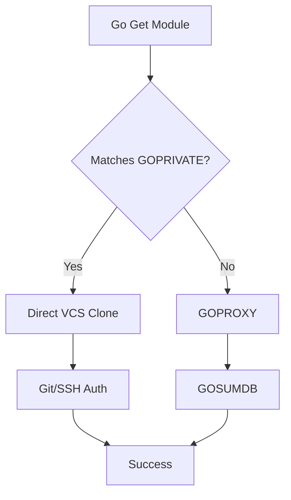

# [BK-02-CH-02] Private Module Authentication

**Securing Proprietary Codebases**
*Target: Memahami cara Go mengakses repository privat di dalam jaringan korporat secara aman dalam waktu < 4 menit.*

## 1. Definisi & Konsep (The Logic)

Secara default, Go mencoba memvalidasi setiap modul melalui Proxy dan SumDB publik. Untuk modul privat yang berada di GitHub Enterprise, GitLab Self-managed, atau Bitbucket internal, mekanisme default ini akan gagal (404/403). Go menyediakan variabel lingkungan khusus untuk mem-bypass infrastruktur publik bagi domain tertentu.

### Terminologi Utama (Senior Terms)
- **GOPRIVATE**: Daftar pola domain (seperti `github.company.com`) yang tidak boleh menggunakan Proxy atau SumDB.
- **GONOPROXY**: Bagian dari GOPRIVATE yang spesifik mematikan Proxy.
- **GONOSUMDB**: Bagian dari GOPRIVATE yang spesifik mematikan verifikasi Checksum Database.
- **.netrc / _netrc**: File kredensial standar industri untuk menyimpan username/password (token) untuk akses mesin-ke-mesin.

## 2. Rasionalitas (Why & How?)

Mengapa dependensi privat tidak bisa via Proxy?
- **Security**: Kode perusahaan tidak boleh meninggalkan jaringan internal atau masuk ke cache server publik.
- **Privacy**: Nama modul dan versi privat tidak boleh terdaftar di log publik (GOSUMDB).

### Mekanisme Kerja Under-the-Hood
Jika modul cocok dengan pola di `GOPRIVATE`:
1. Go mendeteksi bahwa modul ini "privat".
2. Go langsung memanggil terminal `git` (atau VCS lain) untuk melakukan `clone`.
3. Go menyerahkan proses autentikasi (SSH Key atau HTTP Basic Auth) sepenuhnya ke konfigurasi Git sistem.

## 3. Implementasi Utama (The Lab)

Lihat panduan konfigurasi autentikasi di [examples/](./examples/).
1. `01-corporate-setup`: Langkah demi langkah menyetel `GOPRIVATE` dan `.netrc` untuk token GitLab/GitHub.
2. `02-git-ssh-fix`: Trik menggunakan SSH alih-alih HTTPS untuk modul privat melalui konfigurasi global Git.

## 4. Model Mental Visual (The Assets)

### Private vs Public Flow

---
*Back to [BK-02 Page](../README.md)*
