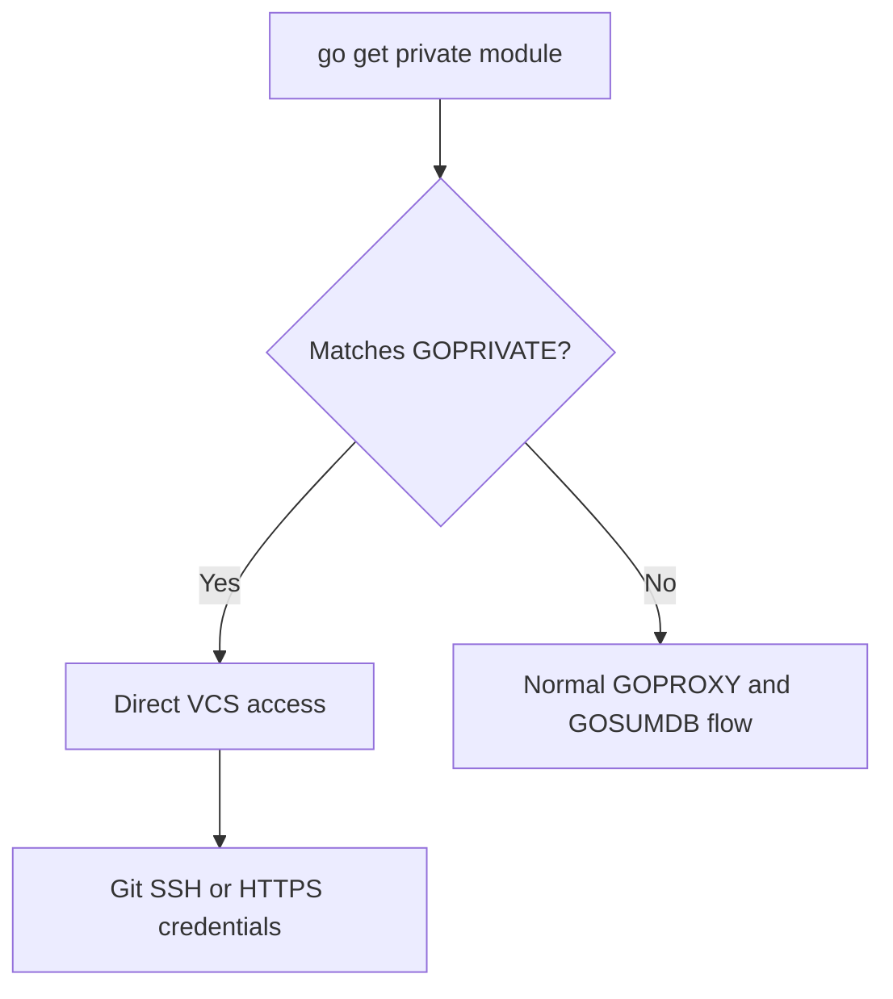

# CH-02: Private Module Authentication

## 1. Tahap 1: Source Alignment dan Judul

- **Source Link**: [Go Modules Reference: Private modules](https://go.dev/ref/mod#private-modules) | [Go FAQ: git_https](https://go.dev/doc/faq#git_https)
- **Framing**: Modul privat butuh alur yang berbeda dari modul publik karena kode, nama modul, dan aksesnya tidak boleh bocor ke infrastruktur publik.

## 2. Tahap 2: Konsep dan Rasionalitas

### Definisi
Private module authentication adalah rangkaian konfigurasi yang membuat toolchain Go mengambil modul privat langsung dari VCS atau infrastruktur internal dengan aturan akses yang sesuai.

### Rasionalitas
Mekanisme ini dipilih karena:

1. **Privasi organisasi tetap terjaga**  
   Nama modul dan metadata privat tidak perlu dikirim ke proxy atau checksum service publik.
2. **Akses dependency jadi eksplisit**  
   Variabel seperti `GOPRIVATE` memberi tahu toolchain domain mana yang harus diperlakukan berbeda.
3. **Workflow korporat lebih dapat diprediksi**  
   Git credential, SSH, atau `.netrc` bisa diatur sebagai jalur autentikasi yang konsisten.

### Analogi Model Mental
Bayangkan dokumen internal perusahaan. Dokumen publik bisa lewat jalur logistik umum, tetapi dokumen rahasia harus masuk melalui gerbang khusus dengan pemeriksaan identitas yang berbeda.

### Terminologi Teknis
- **`GOPRIVATE`**: pola domain modul yang harus diperlakukan sebagai privat.
- **`GONOPROXY`**: override untuk menonaktifkan proxy pada domain tertentu.
- **`GONOSUMDB`**: override untuk menonaktifkan checksum database pada domain tertentu.

## 3. Tahap 3: Visualisasi Sistem

## 4. Tahap 4: Mekanisme Pembuktian

Saat path modul cocok dengan pola di `GOPRIVATE`, toolchain Go menyesuaikan alur resolusi sehingga dependency itu tidak diperlakukan seperti modul publik biasa. Dalam praktiknya, autentikasi lalu diserahkan ke konfigurasi Git, SSH key, token, atau mekanisme kredensial mesin yang dipakai organisasi.

Yang penting untuk `RAK-03`:
- private module workflow adalah evolusi nyata dari engineering di tim modern;
- konfigurasi environment bukan detail sampingan, tetapi bagian inti dari keberhasilan supply chain privat;
- perbedaan public vs private flow harus jelas sejak awal agar debugging dependency tidak membingungkan.

## 5. Tahap 5: Lab Praktis

Lihat contoh konfigurasi di folder [examples/](./examples):
- [01-corporate-setup](./examples/01-corporate-setup) - Setup dasar `GOPRIVATE` dan kredensial untuk lingkungan korporat.
- [02-git-ssh-fix](./examples/02-git-ssh-fix) - Contoh pendekatan SSH untuk memperbaiki akses modul privat.

---
*Status: [x] Complete*
