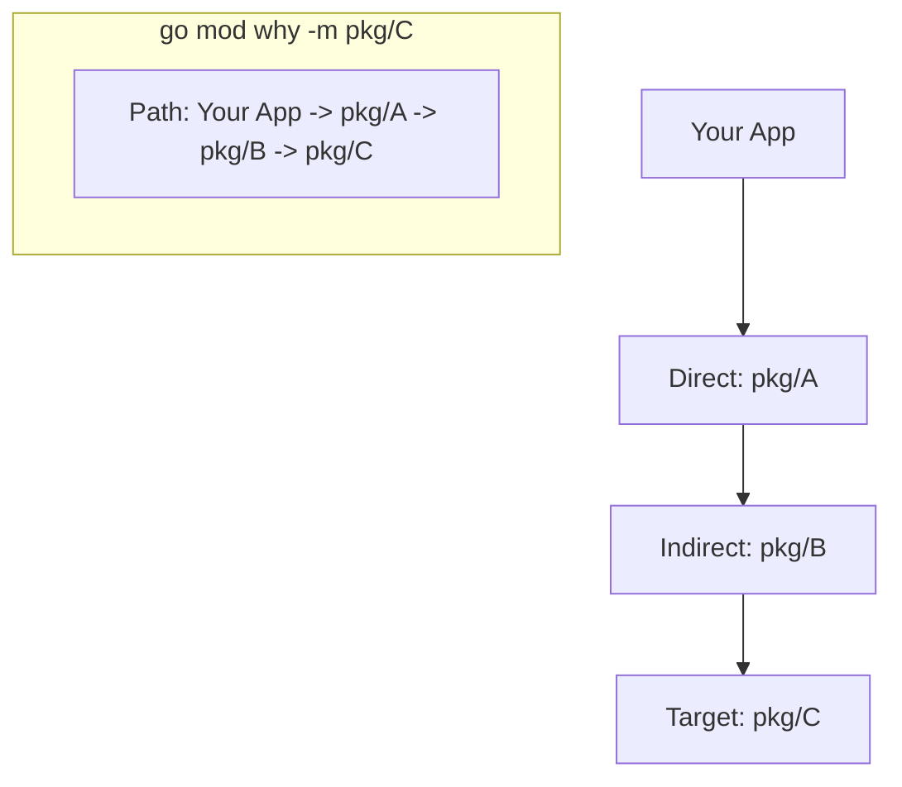

# [BK-03-CH-01] `go list` & `go mod edit`

**The Invisible Power Tooling**
*Target: Memahami cara menginspeksi grafik dependensi dan melakukan otomasi modifikasi `go.mod` dalam waktu < 4 menit.*

## 1. Definisi & Konsep (The Logic)

Selain perintah standar seperti `tidy` dan `get`, Go menyediakan alat untuk inspeksi mendalam (`go list`) dan manipulasi programmatik (`go mod edit`). Ini sangat berguna untuk skrip CI/CD atau saat Anda perlu mencari tahu mengapa sebuah paket tertentu ikut diunduh.

### Terminologi Utama (Senior Terms)
- **JSON Output (`-json`)**: Mode output `go list` yang mudah diparsing oleh skrip.
- **Dependency Graph**: Struktur pohon yang menunjukkan hubungan antar modul.
- **`go mod why`**: Perintah untuk melacak jalur dari modul utama ke dependensi transitif tertentu.

## 2. Rasionalitas (Why & How?)

Mengapa butuh tool ini?
- **Otomasi**: Bayangkan Anda harus meng-update versi 100 microservices secara bersamaan via skrip; Anda akan menggunakan `go mod edit`.
- **Debugging Bloat**: Menemukan alasan mengapa binary membengkak karena dependensi yang tidak diinginkan (`go mod why`).

### Mekanisme Kerja Under-the-Hood
1. **`go list -m -json all`**: Membaca seluruh database modul di cache dan workspace, lalu membuangnya dalam format objek terstruktur.
2. **`go mod edit`**: Tidak seperti mengedit manual dengan Text Editor, perintah ini menjamin file `go.mod` tetap valid secara sintaksis dan mengikuti aturan penulisan resmi.

## 3. Implementasi Utama (The Lab)

Lihat teknik otomasi manifest di [examples/](./examples/).
1. `01-graph-inspection`: Skrip untuk mengekstrak informasi versi dependensi secara massal.
2. `02-programmatic-edit`: Simulasi mengubah dependensi via terminal tanpa membuka file.

## 4. Model Mental Visual (The Assets)

### Tracking Dependency Roots

---
*Back to [BK-03 Page](../README.md)*
