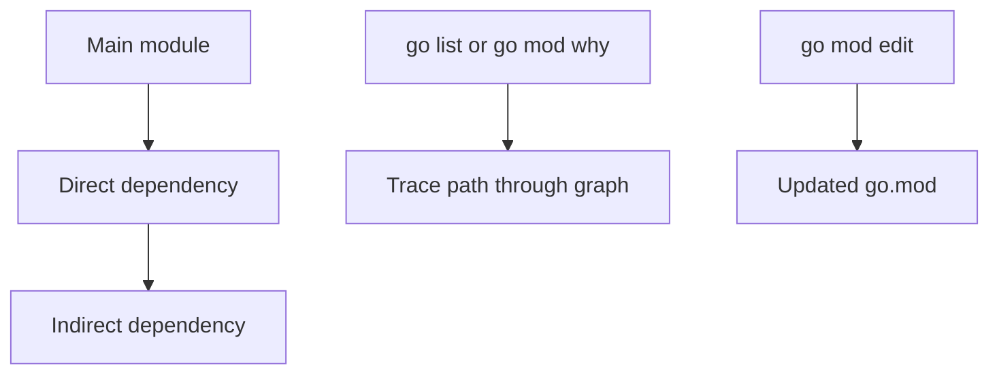

# CH-01: Tooling Automation with `go list` and `go mod edit`

## 1. Tahap 1: Source Alignment dan Judul

- **Source Link**: [go list](https://pkg.go.dev/cmd/go#hdr-List_packages_or_modules) | [go mod edit](https://pkg.go.dev/cmd/go#hdr-Edit_go_mod_from_tools_or_scripts)
- **Framing**: Toolchain Go menyediakan alat yang tidak hanya untuk build, tetapi juga untuk inspeksi dan otomasi metadata modul. Ini penting saat dependency graph mulai besar dan perlu dikelola lewat script atau CI.

## 2. Tahap 2: Konsep dan Rasionalitas

### Definisi
`go list` adalah alat untuk menampilkan informasi terstruktur tentang package atau modul, sedangkan `go mod edit` adalah alat untuk memodifikasi `go.mod` secara programmatik dengan tetap menjaga format dan validitasnya.

### Rasionalitas
Mekanisme ini dipilih karena:

1. **Inspeksi graph jadi lebih mudah diautomasi**  
   Output JSON dari toolchain bisa dipakai untuk analisis atau pipeline CI.
2. **Perubahan metadata lebih aman**  
   `go mod edit` mengurangi risiko salah edit manual pada `go.mod`.
3. **Debugging dependency lebih terarah**  
   Tool seperti `go mod why` dan `go list -m` membantu melacak asal dependency transitif.

### Analogi Model Mental
Bayangkan panel kontrol teknis sebuah gudang. Bukan cuma ada tombol buka-tutup pintu, tetapi juga dashboard untuk melihat alur barang dan alat khusus untuk memperbarui daftar inventaris secara resmi.

### Terminologi Teknis
- **JSON Output**: mode output terstruktur yang mudah diproses script.
- **Dependency Graph**: hubungan antara modul utama dan dependency transitifnya.
- **Programmatic Edit**: perubahan metadata melalui tool, bukan editor teks biasa.

## 3. Tahap 3: Visualisasi Sistem

## 4. Tahap 4: Mekanisme Pembuktian

`go list` membaca metadata package atau modul dari workspace, cache, dan module graph lalu menyajikannya dalam format yang bisa dikonsumsi manusia atau script. `go mod edit` bekerja langsung pada struktur `go.mod`, sehingga perubahan tetap sesuai aturan sintaks toolchain.

Nilai evolusinya untuk `RAK-03`:
- dependency graph tidak diperlakukan sebagai sesuatu yang gelap dan tak terlihat;
- otomatisasi maintenance menjadi bagian resmi workflow;
- debugging dependency bisa dilakukan dengan alat yang disediakan langsung oleh ekosistem Go.

## 5. Tahap 5: Lab Praktis

Lihat contoh otomasi di folder [examples/](./examples):
- [01-tooling-automation](./examples/01-tooling-automation) - Eksperimen inspeksi graph dan perubahan metadata modul lewat CLI Go.

---
*Status: [x] Complete*
