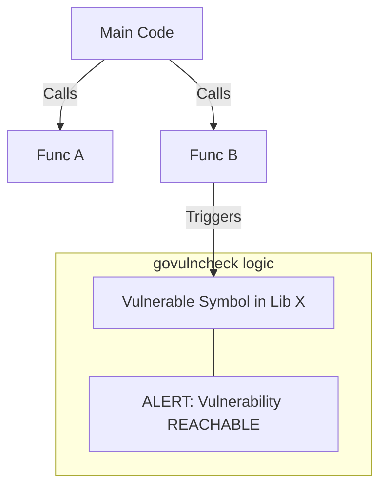

# [BK-03-CH-02] Vulnerability Checking (`govulncheck`)

**Defense in Depth for Go Applications**
*Target: Memahami cara mendeteksi kerentanan keamanan yang benar-benar memengaruhi kode Anda dalam waktu < 4 menit.*

## 1. Definisi & Konsep (The Logic)

`govulncheck` adalah alat bantu resmi dari tim Go untuk memindai dependensi proyek terhadap **Go Vulnerability Database**. Berbeda dengan pemindai statis biasa yang hanya melihat versi di `go.mod`, `govulncheck` melakukan analisis grafik panggilan (*call graph*) untuk menentukan apakah kode Anda benar-benar memanggil fungsi yang memiliki kerentanan tersebut.

### Terminologi Utama (Senior Terms)
- **Vulnerability Database (vuln.go.dev)**: Sumber data terpercaya yang dikelola oleh tim Go untuk CVE (Common Vulnerabilities and Exposures) pada ekosistem Go.
- **Affects Symbols**: Indikasi bahwa fungsi atau variabel spesifik yang rentan benar-benar digunakan dalam kode.
- **Transitive Vulnerability**: Kerentanan yang ada pada dependensi dari dependensi Anda.

## 2. Rasionalitas (Why & How?)

Mengapa menggunakan `govulncheck` alih-alih `npm audit` atau tool sejenis?
- **Low Noise/False Positives**: Banyak tool lain memberikan peringatan hanya karena versi modul "tua". `govulncheck` hanya memberikan peringatan jika fungsi yang rentan tersebut **terjangkau** (*reachable*) oleh eksekusi aplikasi Anda.
- **Binary Scanning**: Anda bisa memindai file binary `.exe` atau ELF yang sudah di-compile untuk mengetahui apakah ia mengandung kerentanan yang belum di-patch.

### Mekanisme Kerja Under-the-Hood
1. Go membangun *Typed AST (Abstract Syntax Tree)* dan *Call Graph* dari aplikasi Anda.
2. Go mencocokkan setiap pemanggilan fungsi dengan daftar simbol yang teridentifikasi rentan di database.
3. Hasilnya dikategorikan: **Informational** (ada di modul tapi tidak dipakai) vs **Actionable** (dipakai dalam kode).

## 3. Implementasi Utama (The Lab)

Lihat teknik audit keamanan di [examples/](./examples/).
1. `01-vuln-scan`: Simulasi deteksi kerentanan pada modul lama yang memiliki celah keamanan terkenal.

## 4. Model Mental Visual (The Assets)

### Call Graph Analysis

---
*Back to [BK-03 Page](../README.md)*
