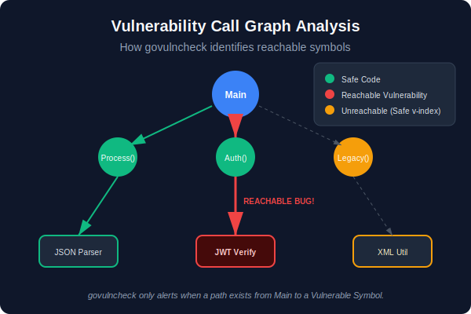
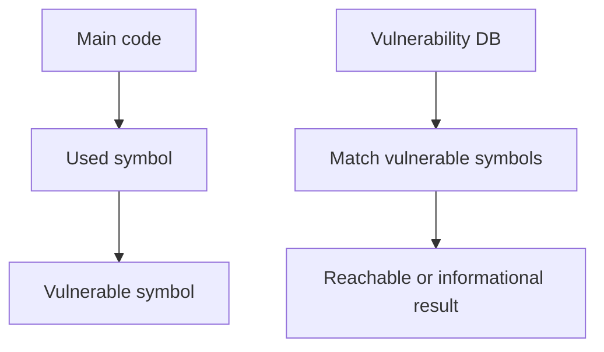

# CH-02: Vulnerability Checking with `govulncheck`

## 1. Tahap 1: Source Alignment dan Judul

- **Source Link**: [govulncheck](https://pkg.go.dev/golang.org/x/vuln/cmd/govulncheck) | [vuln.go.dev](https://vuln.go.dev/)
- **Framing**: `govulncheck` penting karena audit keamanan dependency tidak cukup hanya melihat versi modul. Yang lebih penting adalah apakah simbol rentan itu benar-benar terjangkau oleh kode kita.

## 2. Tahap 2: Konsep dan Rasionalitas

### Definisi
`govulncheck` adalah alat resmi Go untuk memeriksa apakah aplikasi, package, atau binary menggunakan dependency yang memiliki kerentanan yang relevan.

### Rasionalitas
Mekanisme ini dipilih karena:

1. **Noise audit lebih rendah**  
   Temuan menjadi lebih berguna karena tidak semua kerentanan transitif langsung dianggap actionable.
2. **Keamanan dependency lebih dekat ke kode nyata**  
   Fokusnya bukan hanya pada versi, tetapi juga pada jalur pemakaian simbol yang rentan.
3. **Tooling resmi lebih mudah diintegrasikan**  
   Audit keamanan menjadi bagian alami dari workflow Go modern.

### Analogi Model Mental
Bayangkan inspeksi gedung. Bukan semua kabel tua langsung dianggap bahaya kritis, tetapi yang diperiksa adalah kabel mana yang benar-benar masih tersambung ke ruangan aktif dan bisa memicu risiko nyata.

### Terminologi Teknis
- **Vulnerability Database**: sumber data resmi kerentanan ekosistem Go.
- **Reachable Symbol**: fungsi atau simbol rentan yang benar-benar bisa dicapai oleh alur eksekusi aplikasi.
- **Actionable Finding**: temuan yang relevan dan patut ditindaklanjuti.

## 3. Tahap 3: Visualisasi Sistem

## 4. Tahap 4: Mekanisme Pembuktian

`govulncheck` membangun pemahaman terhadap package dan call graph program, lalu mencocokkannya dengan data kerentanan dari database Go. Dengan begitu, hasilnya tidak berhenti di "versi ini punya CVE", tetapi bergerak ke "apakah aplikasi ini benar-benar menyentuh bagian yang rentan".

Nilai evolusinya untuk `RAK-03`:
- audit keamanan menjadi lebih presisi;
- dependency graph dinilai dari sisi risiko nyata, bukan sekadar daftar versi;
- workflow keamanan lebih cocok untuk engineer yang perlu bertindak cepat tanpa tenggelam di false positive.

## 5. Tahap 5: Lab Praktis

Lihat contoh audit di folder [examples/](./examples):
- [01-vuln-scan](./examples/01-vuln-scan) - Demonstrasi audit kerentanan pada dependency yang punya isu keamanan.

---
*Status: [x] Complete*
