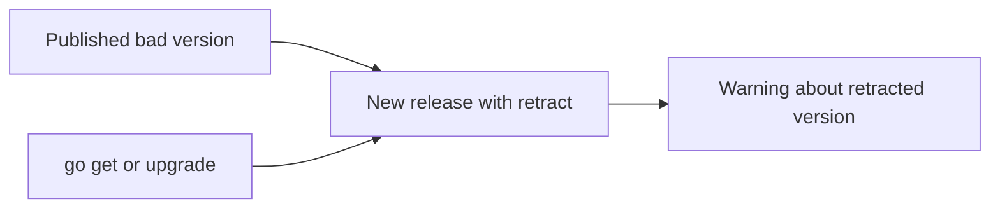

# CH-03: Version Retraction

## 1. Tahap 1: Source Alignment dan Judul

- **Source Link**: [Go Modules Reference: retract directive](https://go.dev/ref/mod#go-mod-file-retract) | [Go Modules: v2 and Beyond](https://go.dev/blog/v2-go-modules)
- **Framing**: Setelah versi modul dipublikasikan, isinya tidak bisa dianggap mudah dihapus begitu saja. Karena itu, Go menyediakan cara resmi untuk menandai versi yang seharusnya tidak dipakai lagi.

## 2. Tahap 2: Konsep dan Rasionalitas

### Definisi
Version retraction adalah mekanisme di `go.mod` yang memungkinkan maintainer menandai satu versi atau rentang versi modul sebagai versi yang sebaiknya tidak digunakan lagi.

### Rasionalitas
Mekanisme ini dipilih karena:

1. **Kesalahan rilis bisa diumumkan secara resmi**  
   Maintainer tetap punya cara memperingatkan pengguna tanpa memalsukan sejarah publikasi.
2. **Transparansi lebih baik**  
   Pengguna tahu versi mana yang bermasalah dan kenapa versi itu ditarik.
3. **Ekosistem tetap stabil**  
   Karena artefak publik sudah terlanjur tersebar, solusi yang realistis adalah memberi sinyal resmi, bukan berpura-pura versi itu tidak pernah ada.

### Analogi Model Mental
Bayangkan penerbit buku mencetak edisi yang salah. Buku itu mungkin sudah telanjur beredar, tetapi penerbit masih bisa mengeluarkan pemberitahuan resmi bahwa edisi tertentu cacat dan pembaca sebaiknya beralih ke cetakan revisi.

### Terminologi Teknis
- **`retract` Directive**: instruksi untuk menandai versi yang ditarik.
- **Retraction Rationale**: penjelasan mengapa versi itu ditarik.
- **Immutable Release Artifact**: artefak versi yang sudah dipublikasikan dan tidak diasumsikan bisa diubah sesuka hati.

## 3. Tahap 3: Visualisasi Sistem

## 4. Tahap 4: Mekanisme Pembuktian

Retraction bekerja dengan menerbitkan versi baru yang berisi directive `retract` untuk versi bermasalah. Saat toolchain membaca metadata modul terbaru, ia bisa memberi sinyal bahwa versi lama sudah ditarik dan tidak layak dipilih sebagai upgrade target.

Nilai evolusinya untuk `RAK-03`:
- maintenance modul diperlakukan sebagai lifecycle nyata, bukan proses sekali rilis lalu selesai;
- kesalahan publikasi punya jalur remediasi yang resmi;
- ekosistem dependency menjadi lebih transparan saat terjadi insiden.

## 5. Tahap 5: Lab Praktis

Lihat simulasi penarikan versi di folder [examples/](./examples):
- [01-publish-retraction](./examples/01-publish-retraction) - Contoh penulisan directive `retract` dan cara mengomunikasikan alasan penarikannya.

---
*Status: [x] Complete*
