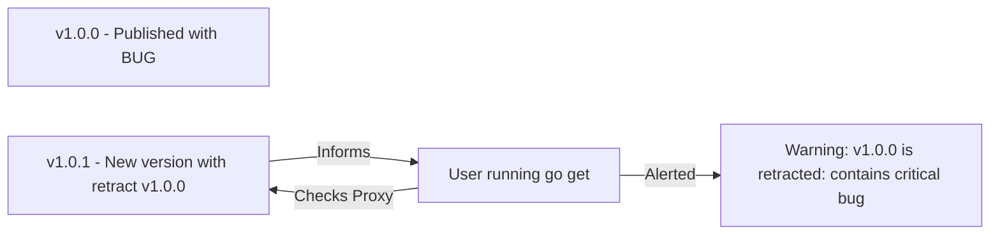

# [BK-03-CH-03] Version Retraction

**Fixing 'Mistakes' in Production**
*Target: Memahami cara menarik kembali versi modul yang sudah terlanjur dipublikasikan tanpa merusak sistem orang lain dalam waktu < 4 menit.*

## 1. Definisi & Konsep (The Logic)

Versi modul Go bersifat **immutable** (tidak dapat diubah) setelah masuk ke Proxy server. Namun, terkadang seorang maintainer melakukan kesalahan fatal (misal: kebocoran API Key atau bug kritis). Versi tersebut tidak bisa dihapus dari Proxy, tetapi bisa di-**retract** (ditarik kembali) menggunakan direktif khusus di file `go.mod`.

### Terminologi Utama (Senior Terms)
- **`retract` Directive**: Instruksi di `go.mod` yang menyatakan bahwa satu atau rentang versi tertentu tidak boleh digunakan.
- **Retraction Rationale**: Komentar di atas direktif `retract` yang akan ditampilkan oleh Go CLI saat pengguna mencoba mengunduh versi tersebut.
- **Version Pinning**: Praktik tetap menggunakan versi tertentu meskipun sudah di-retract (tidak disarankan, tapi dimungkinkan).

## 2. Rasionalitas (Why & How?)

Mengapa tidak di-delete saja tag Git-nya?
- **Proxy Cache**: Menghapus tag di GitHub tidak menghapus zip di `proxy.golang.org`. Orang lain akan tetap bisa mengunduhnya.
- **Transparency**: Retraction memberikan alasan yang jelas bagi pengguna mengapa versi tersebut ditarik, sehingga mereka tahu harus pindah ke versi mana.

### Mekanisme Kerja Under-the-Hood
1. Maintainer merilis versi baru (misal `v1.0.1`) yang file `go.mod`-nya berisi `retract v1.0.0`.
2. Saat pengguna menjalankan `go get`, Go CLI akan melihat manifes terbaru dari Proxy.
3. Jika modul pengguna saat ini adalah `v1.0.0`, Go CLI akan memberikan peringatan (Warning) bahwa versi tersebut telah ditarik dan menyarankan upgrade.

## 3. Implementasi Utama (The Lab)

Lihat simulasi penarikan versi di [examples/](./examples/).
1. `01-publish-retraction`: Panduan cara menulis direktif `retract` dan pesan alasannya.

## 4. Model Mental Visual (The Assets)

### Retraction Lifecycle

---
*Back to [BK-03 Page](../README.md)*
