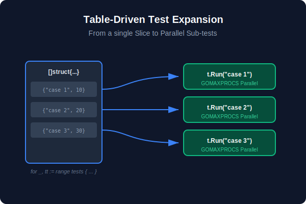
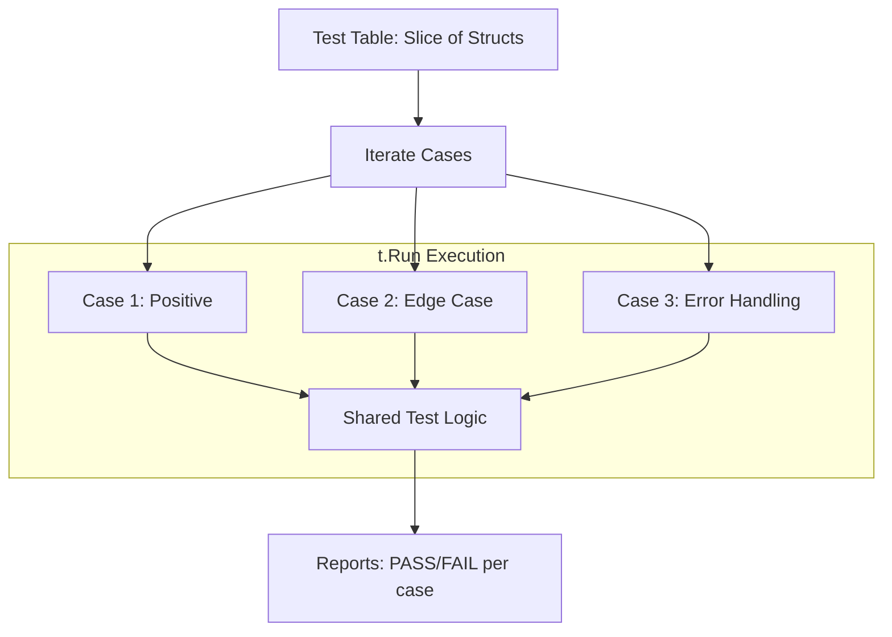

# [BK-01-CH-01] Table-Driven Design

**The Idiomatic Way to Test in Go**
*Target: Memahami pola desain pengujian paling standar di Go untuk menangani banyak kasus input dalam waktu < 4 menit.*

## 1. Definisi & Konsep (The Logic)

**Table-Driven Testing (TDT)** adalah pola di mana sekelompok kasus uji (input dan output yang diharapkan) didefinisikan dalam sebuah tabel (biasanya slice dari struct anonim). Logika pengujian hanya ditulis sekali, lalu diulang untuk setiap baris dalam tabel tersebut.

### Terminologi Utama (Senior Terms)
- **Sub-tests (`t.Run`)**: Mekanisme untuk menjalankan kasus uji individu dalam satu fungsi pengujian, memungkinkan isolasi laporan kegagalan.
- **`t.Parallel()`**: Instruksi untuk menjalankan pengujian secara konkuren, mempercepat total waktu eksekusi test suite.
- **Anonymous Struct Tables**: Struktur data sementara yang digunakan untuk menampung field input, expected, dan metadata uji.

## 2. Rasionalitas (Why & How?)

Mengapa Go tidak menggunakan `assert` atau `suite` bergaya OOP secara native?
- **DRY (Don't Repeat Yourself)**: Menghindari duplikasi logika pengujian (setup/execution/teardown) untuk input yang berbeda.
- **Readability**: Memisahkan *data uji* dari *logika uji*. Menambah kasus baru semudah menambah baris di slice.
- **Granular Reporting**: Dengan `t.Run`, jika satu kasus gagal, Anda tahu persis mana yang bermasalah tanpa menghentikan sisa pengujian.

### Mekanisme Kerja Under-the-Hood
1. Anda mendefinisikan slice `tests := []struct{...}{...}`.
2. Anda melakukan iterasi `for _, tt := range tests`.
3. Di dalam loop, Anda memanggil `t.Run(tt.name, func(t *testing.T) { ... })`.
4. Jika `t.Parallel()` dipanggil di dalam `t.Run`, Go scheduler akan menjalankan sub-test tersebut secara paralel dengan sub-test lain yang juga memiliki flag parallel.

## 3. Implementasi Utama (The Lab)

Lihat pembuktian kode fungsional di [examples/](./examples/).
1. `01-basic-tdt`: Implementasi standar TDT untuk fungsi kalkulasi.
2. `02-parallel-tdt`: Demonstrasi cara kerja `t.Parallel()` dan jebakan *variable scoping* di dalam loop.

## 4. Model Mental Visual (The Assets)

### Table-Driven Flow

---
*Back to [BK-01 Page](../README.md)*
