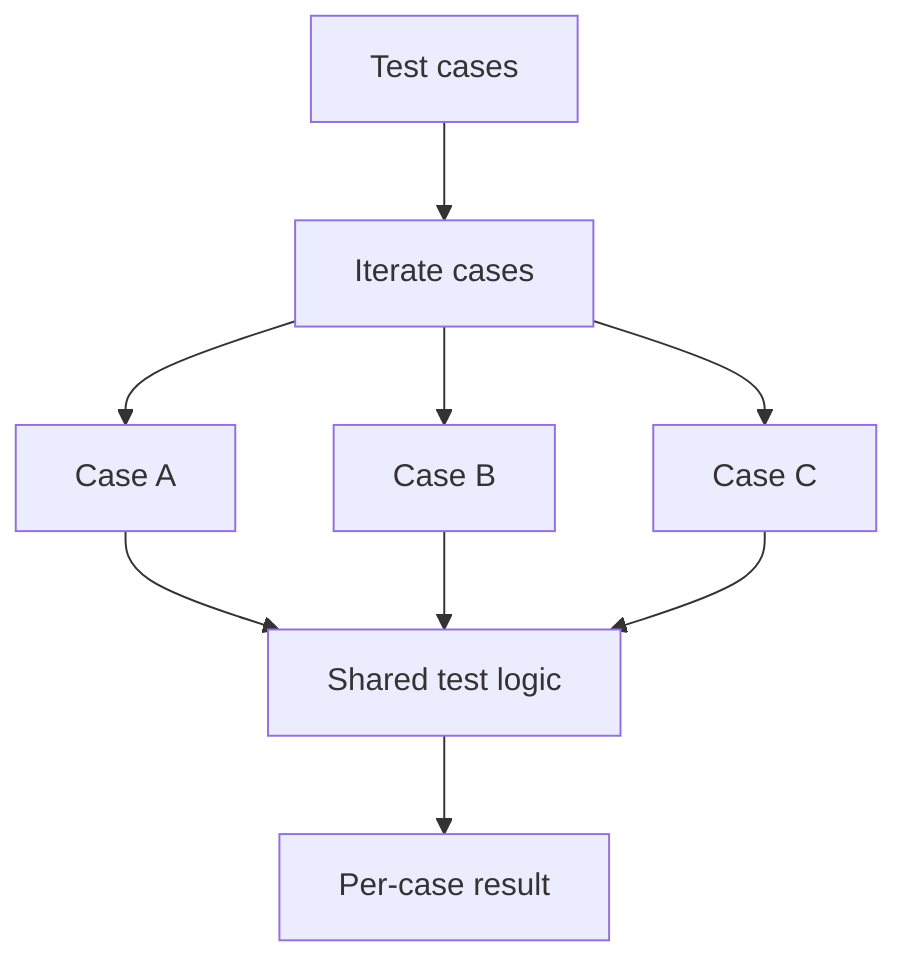

# CH-01: Table-Driven Design

## 1. Tahap 1: Source Alignment dan Judul

- **Source Link**: [Go Wiki: TableDrivenTests](https://go.dev/wiki/TableDrivenTests) | [testing package](https://pkg.go.dev/testing)
- **Framing**: Table-driven tests adalah pola paling idiomatik di Go untuk menguji banyak kasus tanpa menduplikasi logika pengujian yang sama berulang-ulang.

## 2. Tahap 2: Konsep dan Rasionalitas

### Definisi
Table-driven testing adalah pola di mana kasus uji disimpan sebagai data, biasanya dalam slice of struct, lalu satu loop pengujian menjalankan logika yang sama untuk setiap baris kasus.

### Rasionalitas
Pola ini dipilih karena:

1. **Duplikasi test berkurang**  
   Satu logika test bisa dipakai untuk banyak variasi input dan output.
2. **Kasus baru mudah ditambahkan**  
   Menambah test sering cukup dengan menambah satu baris data baru.
3. **Laporan kegagalan bisa lebih jelas**  
   Dengan `t.Run`, setiap kasus bisa diberi nama dan dipisahkan hasilnya.

### Analogi Model Mental
Bayangkan daftar pengecekan kualitas produk di pabrik. Pemeriksa memakai prosedur yang sama, tetapi menjalankannya untuk banyak sampel yang parameter dan hasil harapannya berbeda-beda.

### Terminologi Teknis
- **Subtest**: test kecil yang dijalankan dengan `t.Run`.
- **Anonymous Struct Table**: tabel kasus uji dalam bentuk struct sementara.
- **`t.Parallel()`**: cara menjalankan subtest tertentu secara paralel.

## 3. Tahap 3: Visualisasi Sistem

## 4. Tahap 4: Mekanisme Pembuktian

Di Go, table-driven tests bekerja baik karena testing package mendorong logika test yang sederhana dan eksplisit. Data kasus disiapkan lebih dulu, lalu loop menjalankan fungsi yang sama untuk setiap kasus, sering dipadukan dengan `t.Run` agar hasilnya terisolasi.

Nilai evolusinya untuk `RAK-03`:
- test jadi lebih mudah dirawat saat jumlah kasus bertambah;
- struktur data dan struktur pengujian terpisah dengan jelas;
- idiom ini menjadi fondasi bagi banyak pola test lain di Go.

## 5. Tahap 5: Lab Praktis

Lihat pembuktian kode di folder [examples/](./examples):
- [01-basic-tdt](./examples/01-basic-tdt) - Contoh table-driven test dasar.
- [02-parallel-tdt](./examples/02-parallel-tdt) - Eksperimen subtest paralel dan jebakan scoping di dalam loop.

---
*Status: [x] Complete*
