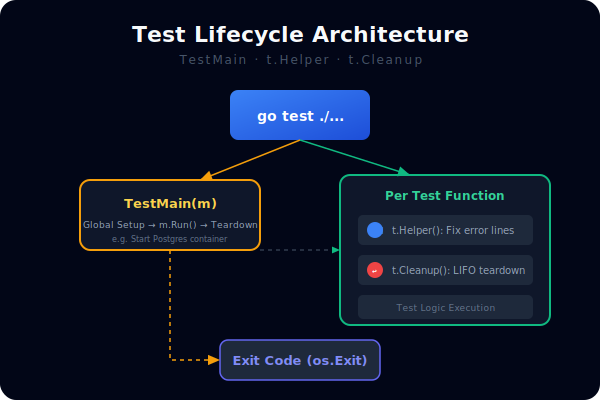
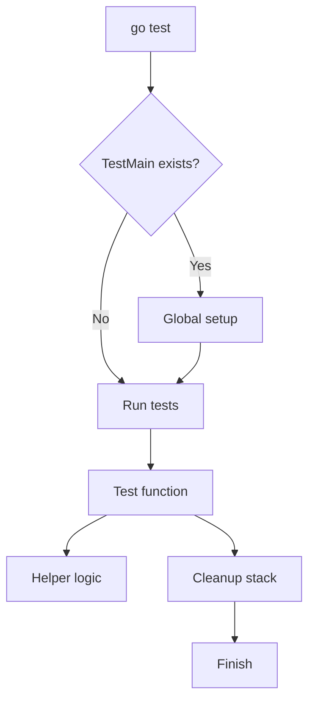

# CH-02: Test Helpers and Main Setup

## 1. Tahap 1: Source Alignment dan Judul

- **Source Link**: [testing package](https://pkg.go.dev/testing) | [Go Blog: Subtests and Sub-benchmarks](https://go.dev/blog/subtests)
- **Framing**: Saat suite test membesar, kualitas pengujian tidak hanya bergantung pada assertion, tetapi juga pada bagaimana helper, setup, dan cleanup diatur.

## 2. Tahap 2: Konsep dan Rasionalitas

### Definisi
Test helpers dan main setup adalah pola pengelolaan lifecycle test melalui alat seperti `t.Helper()`, `t.Cleanup()`, dan `TestMain` agar kode pengujian tetap rapi dan error tetap mudah dilacak.

### Rasionalitas
Pola ini dipilih karena:

1. **Keterbacaan test meningkat**  
   Helper memindahkan detail berulang tanpa mengaburkan lokasi error utama.
2. **Lifecycle resource lebih aman**  
   Setup dan cleanup bisa dikendalikan secara eksplisit.
3. **Skala suite test lebih mudah dikelola**  
   Infrastruktur berat tidak perlu ditulis ulang di setiap fungsi test.

### Analogi Model Mental
Bayangkan panggung teater. Ada kru yang menyiapkan lampu dan properti, lalu ada tim yang membersihkan panggung setelah pertunjukan selesai. Penonton fokus ke drama utamanya, bukan ke kerja teknis di belakang layar.

### Terminologi Teknis
- **`t.Helper()`**: penanda fungsi pembantu agar lokasi error dilaporkan di pemanggil.
- **`t.Cleanup()`**: registrasi cleanup yang dijalankan setelah test selesai.
- **`TestMain`**: entry point khusus untuk setup dan teardown tingkat paket.

## 3. Tahap 3: Visualisasi Sistem

## 4. Tahap 4: Mekanisme Pembuktian

`TestMain` memberi kontrol terhadap lifecycle tingkat paket, tetapi karena sifatnya global, ia sebaiknya dipakai hanya jika memang ada kebutuhan setup berat. Untuk kebutuhan lokal, `t.Helper()` dan `t.Cleanup()` biasanya sudah cukup dan lebih aman.

Yang penting untuk `RAK-03`:
- test yang baik bukan hanya soal pass/fail;
- kualitas suite juga ditentukan oleh seberapa jelas lokasi error dan seberapa rapi resource dibersihkan;
- pola lifecycle ini membuat suite lebih stabil saat tumbuh besar.

## 5. Tahap 5: Lab Praktis

Lihat pembuktian lifecycle test di folder [examples/](./examples):
- [01-helper-logic](./examples/01-helper-logic) - Perbandingan perilaku helper dengan dan tanpa `t.Helper()`.
- [02-lifecycle-cleanup](./examples/02-lifecycle-cleanup) - Contoh setup global dan cleanup lokal untuk test.

---
*Status: [x] Complete*
