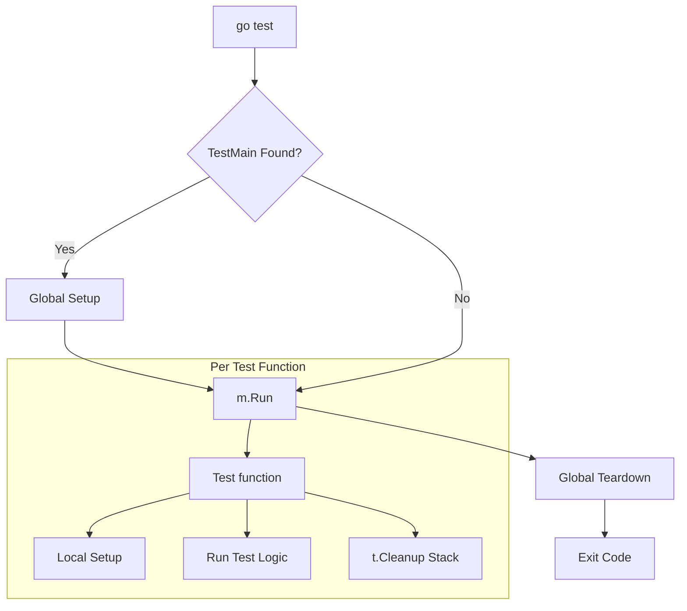

# [BK-01-CH-02] Test Helpers & Main Setup

**Mastering the Test Lifecycle**
*Target: Memahami cara mengelola setup global dan membuat helper pengujian yang bersih dalam waktu < 4 menit.*

## 1. Definisi & Konsep (The Logic)

Dalam pengujian skala besar, Anda sering membutuhkan fungsi pendukung (Helpers) untuk menyederhanakan kode test, atau mekanisme Setup/Teardown untuk mengelola state eksternal (seperti database atau file temporary). Go menyediakan alat khusus untuk menjamin laporan kesalahan tetap akurat dan lifecycle tetap terjaga.

### Terminologi Utama (Senior Terms)
- **`t.Helper()`**: Fungsi untuk menandai bahwa fungsi saat ini adalah "pembantu". Jika terjadi error di dalamnya, Go akan melaporkan baris kode *pemanggil*, bukan baris di dalam helper tersebut.
- **`TestMain(m *testing.M)`**: Entry point khusus dalam sebuah paket testing yang memungkinkan kontrol penuh atas setup sebelum dan sesudah *semua* test dijalankan.
- **`t.Cleanup()`**: Cara modern (Go 1.14+) untuk mendaftarkan fungsi pembersihan yang akan dijalankan otomatis setelah test selesai (pengganti `defer` yang lebih aman dalam sub-tests).

## 2. Rasionalitas (Why & How?)

Mengapa butuh `t.Helper()`?
- **Accuracy**: Tanpa ini, jika helper gagal, semua test akan mengarah ke baris yang sama di dalam file helper, membuat Anda bingung mencari test mana yang memicunya.

Mengapa `TestMain` jarang direkomendasikan jika tidak perlu?
- **Side Effects**: `TestMain` bersifat global satu paket. Ia bisa membuat test suite Anda sulit diparalelkan jika mengelola state global yang sama. Gunakan hanya untuk setup infrastruktur berat (seperti memicu Testcontainers atau load config).

### Mekanisme Kerja Under-the-Hood
1. Saat `go test` dijalankan, Go mencari fungsi `TestMain`.
2. Jika ada, Go menyerahkan kontrol eksekusi (dan exit code) ke `TestMain`. Anda harus memanggil `m.Run()` secara eksplisit.
3. Untuk `t.Cleanup`, fungsi yang didaftarkan akan disimpan dalam *LIFO stack* dan dijalankan bahkan jika test mengalami panic, menjamin resource bocor dapat dicegah.

## 3. Implementasi Utama (The Lab)

Lihat teknik manajemen lifecycle di [examples/](./examples/).
1. `01-helper-logic`: Membandingkan laporan error dengan vs tanpa `t.Helper()`.
2. `02-lifecycle-cleanup`: Penggunaan `TestMain` dan `t.Cleanup` untuk simulasi setup DB.

## 4. Model Mental Visual (The Assets)

### Test Lifecycle Overview

---
*Back to [BK-01 Page](../README.md)*
