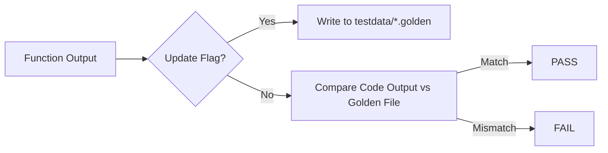

# [BK-01-CH-03] Golden Files Testing

**Testing Large-Scale Complex Outputs**
*Target: Memahami teknik pengujian output besar (seperti JSON/HTML) tanpa mengotori test code dengan string raksasa dalam waktu < 4 menit.*

## 1. Definisi & Konsep (The Logic)

**Golden Files Testing** adalah teknik di mana hasil output sesungguhnya dari sebuah fungsi dibandingkan dengan file referensi "Emas" yang disimpan di disk. Alih-alih menulis `if actual != expectedString`, Anda membandingkan `actual` dengan isi dari file (misal: `testdata/output.golden`).

### Terminologi Utama (Senior Terms)
- **`testdata` Directory**: Folder khusus yang diabaikan oleh tool Go biasa tapi bisa diakses oleh pengujian untuk menyimpan aset statis.
- **`-update` Flag**: Pola idiomatis menggunakan `flag.Bool` untuk memperbarui file Golden secara otomatis jika output aslinya memang sengaja diubah.
- **`os.ReadFile`**: Fungsi standar untuk memuat referensi dari disk.

## 2. Rasionalitas (Why & How?)

Kapan harus menggunakan Golden Files?
- **Complex Outputs**: Response API JSON yang panjang, struktur XML, atau template HTML.
- **Maintainability**: Jika format output berubah, Anda tidak perlu mengedit 100 baris string di kode pengujian. Cukup jalankan pengujian dengan flag `-update`.

### Mekanisme Kerja Under-the-Hood
1. Jalankan test.
2. Jika flag `-update` aktif, tulis `actual` ke file `.golden`.
3. Jika flag tidak aktif, baca file `.golden` lama dan bandingkan dengan `actual`.
4. Jika berbeda, test gagal dan menunjukkan diff-nya.

## 3. Implementasi Utama (The Lab)

Lihat teknik perbandingan data besar di [examples/](./examples/).
1. `01-json-golden`: Menguji response JSON kompleks menggunakan file referensi di folder `testdata/`.

## 4. Model Mental Visual (The Assets)

### Golden File Workflow

---
*Back to [BK-01 Page](../README.md)*
