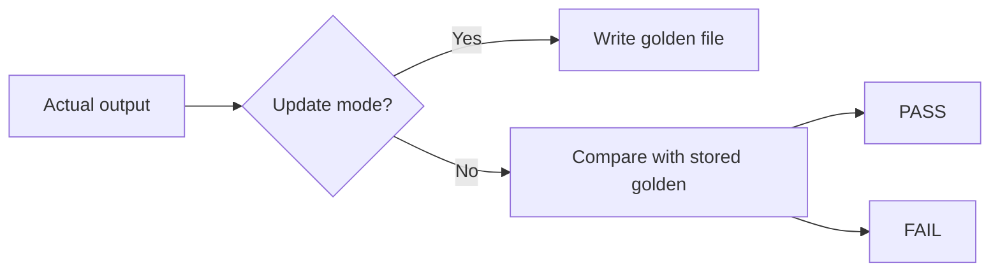

# CH-03: Golden Files

## 1. Tahap 1: Source Alignment dan Judul

- **Source Link**: [go test and testdata convention](https://pkg.go.dev/cmd/go#hdr-Test_packages) | [testing package](https://pkg.go.dev/testing)
- **Framing**: Golden files berguna saat output yang diuji terlalu besar atau terlalu berisik untuk ditulis langsung sebagai string panjang di dalam test.

## 2. Tahap 2: Konsep dan Rasionalitas

### Definisi
Golden file testing adalah pola di mana output aktual dari sebuah fungsi dibandingkan dengan file referensi yang disimpan di disk, biasanya di bawah folder `testdata`.

### Rasionalitas
Pola ini dipilih karena:

1. **Output besar lebih mudah dikelola**  
   JSON, HTML, atau teks panjang bisa dipisahkan dari kode test.
2. **Perubahan output lebih mudah direview**  
   File referensi bisa diperbarui secara sadar saat perilaku memang berubah.
3. **Keterbacaan test tetap terjaga**  
   Test tidak dipenuhi string panjang yang menyulitkan pembacaan logika utamanya.

### Analogi Model Mental
Bayangkan pemeriksa dokumen yang membandingkan cetakan terbaru dengan salinan acuan yang disimpan di arsip. Fokusnya bukan menulis ulang seluruh isi dokumen di form pemeriksaan, tetapi memastikan hasil terbaru masih cocok dengan referensi resmi.

### Terminologi Teknis
- **Golden File**: file referensi hasil yang dianggap benar.
- **`testdata`**: direktori konvensional untuk asset pengujian.
- **Update Flag**: pola untuk memperbarui golden file saat perubahan memang disengaja.

## 3. Tahap 3: Visualisasi Sistem

## 4. Tahap 4: Mekanisme Pembuktian

Test biasanya menghasilkan output aktual, lalu memilih dua jalur: memperbarui file golden jika sedang dalam mode update, atau membaca file golden lama untuk dibandingkan. Dengan pola ini, perubahan perilaku menjadi eksplisit dan mudah diaudit.

Nilai evolusinya untuk `RAK-03`:
- suite test lebih siap menangani output realistis;
- struktur pengujian tetap rapi walau data yang diverifikasi besar;
- maintenance test jadi lebih mudah saat format output berkembang.

## 5. Tahap 5: Lab Praktis

Lihat pembuktian di folder [examples/](./examples):
- [01-json-golden](./examples/01-json-golden) - Contoh perbandingan output JSON dengan golden file.

---
*Status: [x] Complete*
