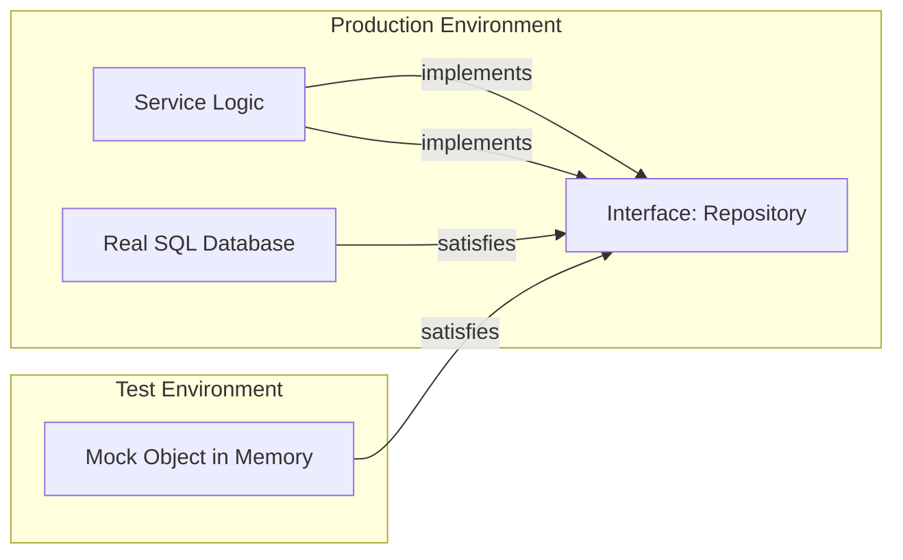

# [BK-02-CH-01] Interface Injection

**Decoupling for Testability**
*Target: Memahami alasan mengapa Interface adalah nyawa dari pengujian unit di Go dalam waktu < 4 menit.*

## 1. Definisi & Konsep (The Logic)

**Interface Injection** adalah teknik *Dependency Injection* di mana service Anda tidak bergantung pada tipe konkret (misal: `*sql.DB`), melainkan pada kontrak kelakuan (Interface). Selama pengujian, Anda bisa "menyuntikkan" implementasi palsu (Mock) yang meniru kelakuan objek asli tanpa harus melakukan koneksi jaringan atau database sungguhan.

### Terminologi Utama (Senior Terms)
- **Small Interfaces**: Prinsip Go untuk membuat interface sekecil mungkin (1-3 method) agar mudah di-mock.
- **Dependency Inversion**: Prinsip SOLID di mana modul tingkat tinggi tidak boleh bergantung pada modul tingkat rendah.
- **Stub vs Mock**: Stub hanya mengembalikan data statis, sedangkan Mock bisa memvalidasi apakah sebuah fungsi dipanggil dengan parameter yang benar.

## 2. Rasionalitas (Why & How?)

Mengapa menggunakan Interface untuk Mocking?
- **Isolasi**: Anda ingin menguji logika hitung diskon tanpa harus peduli apakah database sedang *down* atau tidak.
- **Speed**: Menjalankan mock di memory jauh lebih cepat daripada query I/O.
- **Edge Case Simulation**: Sangat sulit mensimulasikan "Database Error" atau "Network Timeout" dengan objek asli. Dengan Mock, Anda tinggal mengatur: `mock.On("Save").Return(errors.New("connection failed"))`.

### Mekanisme Kerja Under-the-Hood
1. Definisikan interface: `type Fetcher interface { Fetch() string }`.
2. Service menerima interface: `type Service struct { f Fetcher }`.
3. Di kode asli, masukkan `RealFetcher`.
4. Di kode test, masukkan `MockFetcher` (struct yang memiliki method `Fetch()` tapi hanya mengembalikan string buatan).

## 3. Implementasi Utama (The Lab)

Lihat teknik pemisahan dependensi di [examples/](./examples/).
1. `01-manual-mock`: Membuat mock secara manual tanpa menggunakan library pihak ketiga (cara paling murni).

## 4. Model Mental Visual (The Assets)

### Interface Injection Pattern

---
*Back to [BK-02 Page](../README.md)*
