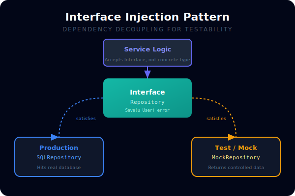
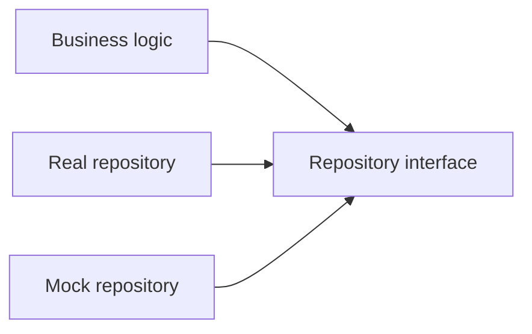

# CH-01: Interface Injection

## 1. Tahap 1: Source Alignment dan Judul

- **Source Link**: [Go Wiki: CodeReviewComments - Interfaces](https://go.dev/wiki/CodeReviewComments#interfaces) | [Effective Go: Interfaces and other types](https://go.dev/doc/effective_go#interfaces_and_types)
- **Framing**: Interface injection penting dalam testing Go karena ia memisahkan logika yang ingin diuji dari detail I/O atau dependency konkret yang sulit dikendalikan.

## 2. Tahap 2: Konsep dan Rasionalitas

### Definisi
Interface injection adalah teknik dependency injection di mana komponen menerima kontrak perilaku dalam bentuk interface, bukan bergantung langsung pada tipe konkret tertentu.

### Rasionalitas
Pola ini dipilih karena:

1. **Test bisa diisolasi**  
   Logic utama dapat diuji tanpa harus menyentuh database, network, atau filesystem sungguhan.
2. **Edge case lebih mudah disimulasikan**  
   Error, timeout, atau hasil khusus bisa dimodelkan dengan implementasi mock sederhana.
3. **Desain kontrak jadi lebih jelas**  
   Interface kecil membantu menunjukkan perilaku minimum yang benar-benar dibutuhkan.

### Analogi Model Mental
Bayangkan colokan listrik universal. Perangkat utama tidak perlu tahu merek pembangkit dayanya. Selama soketnya mengikuti bentuk yang sama, sumber daya bisa diganti untuk kebutuhan berbeda, termasuk simulasi saat pengujian.

### Terminologi Teknis
- **Small Interface**: interface kecil yang hanya berisi method yang benar-benar dibutuhkan.
- **Dependency Injection**: teknik memasok dependency dari luar, bukan membuatnya diam-diam di dalam komponen.
- **Stub / Mock**: implementasi pengganti untuk testing.

## 3. Tahap 3: Visualisasi Sistem

## 4. Tahap 4: Mekanisme Pembuktian

Di Go, interface dipenuhi secara implisit. Itu membuat kita bisa mendefinisikan interface kecil di sisi consumer, lalu menyuntikkan implementasi nyata atau mock tanpa mengubah logika bisnis inti.

Nilai evolusinya untuk `RAK-03`:
- testability menjadi bagian dari desain, bukan tempelan belakangan;
- dependency nyata dan dependency mock memakai kontrak yang sama;
- perubahan di layer I/O tidak harus memecahkan test unit yang fokus pada logic.

## 5. Tahap 5: Lab Praktis

Lihat contoh pemisahan dependency di folder [examples/](./examples):
- [01-manual-mock](./examples/01-manual-mock) - Implementasi manual mock berbasis interface kecil tanpa library tambahan.

---
*Status: [x] Complete*
