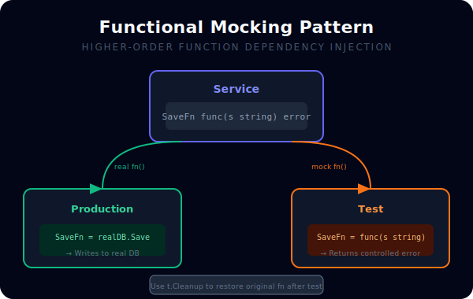
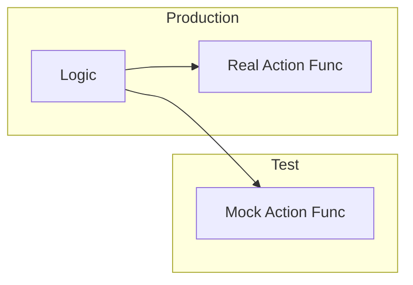

# [BK-02-CH-02] Higher-Order Function Mocks

**Lightweight Mocking without Interfaces**
*Target: Memahami teknik mocking fungsional untuk pengujian yang lebih ringkas tanpa overhead struct dalam waktu < 3 menit.*

## 1. Definisi & Konsep (The Logic)

Tidak semua dependensi harus dibungkus dalam Interface. Dalam beberapa kasus, Anda bisa menggunakan **Higher-Order Functions** (fungsi yang menerima fungsi lain sebagai parameter) untuk melakukan mocking. Ini sering disebut sebagai "Functional Mocking".

### Terminologi Utama (Senior Terms)
- **Function Signature as Type**: Mendefinisikan tipe data berdasarkan tanda tangan fungsi (misal: `type Saver func(data string) error`).
- **Dependency Closure**: Teknik mengunci dependensi dalam sebuah variabel fungsi yang bisa diganti sesuka hati saat pengujian.
- **Overhead Reduction**: Menghindari pembuatan boilerplate interface dan struct jika tujuan utamanya hanya melakukan mocking satu fungsi.

## 2. Rasionalitas (Why & How?)

Kapan menggunakan teknik ini?
- **Small Logic**: Modul kecil yang hanya memiliki satu dependensi fungsional.
- **Legacy Refactor**: Jika Anda berurusan dengan kode lama yang sulit diubah menjadi interface, menambahkan parameter fungsi seringkali lebih aman.

### Mekanisme Kerja Under-the-Hood
1. Anda membuat variabel fungsi: `var externalCall = func() { ... }`.
2. Saat pengujian, Anda menimpa variabel tersebut: `externalCall = func() { mockBehavior() }`.
3. Gunakan `t.Cleanup` untuk mengembalikan variabel fungsi ke aslinya agar tidak merusak test lain (Global State danger).

## 3. Implementasi Utama (The Lab)

Lihat teknik mocking fungsional di [examples/](./examples/).
1. `01-func-injection`: Menyuntikkan logika pencarian data melalui parameter fungsi.

## 4. Model Mental Visual (The Assets)

### Functional Mocking Flow

---
*Back to [BK-02 Page](../README.md)*
