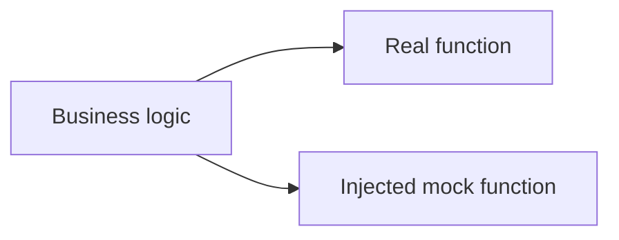

# CH-02: Higher-Order Function Mocks

## 1. Tahap 1: Source Alignment dan Judul

- **Source Link**: [First-Class Functions in Go](https://go.dev/blog/first-class-functions-in-go) | [testing package](https://pkg.go.dev/testing)
- **Framing**: Tidak semua dependency perlu dibungkus dalam interface. Untuk kasus yang kecil, function injection sering lebih ringan dan tetap sangat efektif untuk testing.

## 2. Tahap 2: Konsep dan Rasionalitas

### Definisi
Higher-order function mocking adalah teknik mengganti dependency lewat fungsi yang diterima sebagai parameter atau variabel yang bisa ditimpa saat pengujian.

### Rasionalitas
Pola ini dipilih karena:

1. **Boilerplate lebih rendah**  
   Untuk dependency yang bentuknya hanya satu aksi, function injection sering lebih sederhana daripada membuat interface dan struct tambahan.
2. **Refactor lebih ringan**  
   Cocok untuk kode kecil atau legacy code yang ingin dibuat lebih testable tanpa banyak perubahan struktur.
3. **Perilaku mock tetap eksplisit**  
   Test bisa mengatur fungsi pengganti dengan cepat untuk mensimulasikan hasil tertentu.

### Analogi Model Mental
Bayangkan sebuah tombol aksi di panel kontrol. Dalam mode produksi, tombol itu terhubung ke mesin asli. Dalam mode pengujian, kabelnya dipindah sementara ke simulator agar perilaku mesin bisa diuji tanpa menyalakan alat nyata.

### Terminologi Teknis
- **Higher-Order Function**: fungsi yang menerima fungsi lain atau mengembalikan fungsi.
- **Function Injection**: teknik menyuplai dependency dalam bentuk fungsi.
- **Global Function Override**: pola yang perlu diimbangi cleanup agar tidak bocor ke test lain.

## 3. Tahap 3: Visualisasi Sistem

## 4. Tahap 4: Mekanisme Pembuktian

Di Go, fungsi adalah nilai, jadi dependency bisa diperlakukan sebagai parameter atau variabel yang bisa diganti saat test berjalan. Pola ini sangat kuat untuk kasus sederhana, tetapi perlu disiplin jika dependency disimpan sebagai global variable karena state-nya bisa bocor antar test.

Nilai evolusinya untuk `RAK-03`:
- testing jadi lebih luwes untuk komponen kecil;
- tidak semua masalah perlu diselesaikan dengan interface;
- engineer bisa memilih abstraksi yang paling ringan untuk kebutuhan test yang nyata.

## 5. Tahap 5: Lab Praktis

Lihat contoh function injection di folder [examples/](./examples):
- [01-func-injection](./examples/01-func-injection) - Mocking fungsi secara langsung untuk skenario test yang ringkas.

---
*Status: [x] Complete*
