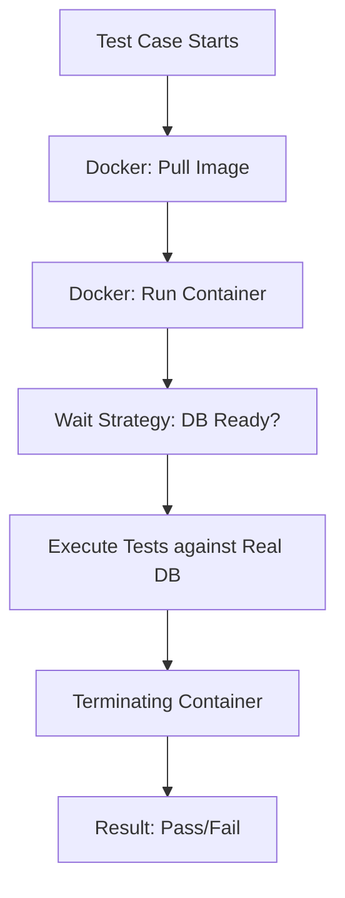

# [BK-02-CH-03] Testcontainers & Real DBs

**Integration Testing Without Mocks**
*Target: Memahami standar tertinggi pengujian integrasi menggunakan container ephemeral dalam waktu < 4 menit.*

## 1. Definisi & Konsep (The Logic)

**Testcontainers** adalah library Go yang memungkinkan Anda memicu container Docker (seperti PostgreSQL, Redis, atau Kafka) secara otomatis dari dalam kode pengujian. Ini memastikan bahwa pengujian integrasi Anda berjalan melawan sistem nyata, bukan sekadar tiruan (Mock), namun tetap terisolasi dan mudah dibersihkan.

### Terminologi Utama (Senior Terms)
- **Ephemeral Infrastructure**: Infrastruktur sementara yang dibuat hanya untuk durasi pengujian dan langsung dihapus setelah selesai.
- **Port Mapping**: Proses menghubungkan port di dalam container Docker ke port acak di host untuk menghindari konflik.
- **Wait Strategy**: Mekanisme untuk memastikan service di dalam container (misal: Postgres) sudah benar-benar siap menerima koneksi sebelum test dimulai.

## 2. Rasionalitas (Why & How?)

Mengapa butuh Testcontainers jika sudah ada Mock?
- **Mock Flaws**: Mock seringkali tidak mencerminkan perilaku asli database (misal: constraint, trigger, atau sintaks SQL spesifik).
- **Confidence**: Pengujian integrasi memberikan kepercayaan diri 100% bahwa kode Anda benar-benar bisa berkomunikasi dengan sistem nyata.
- **CI/CD Alignment**: Selama runner CI Anda memiliki Docker, test suite Anda akan berjalan secara konsisten di mana saja.

### Mekanisme Kerja Under-the-Hood
1. Saat test dimulai, `testcontainers-go` mengirim perintah ke Docker Host.
2. Container diunduh (jika belum ada) dan dijalankan.
3. Testcontainers menunggu hingga service "Ready" (via Log matching atau Port checking).
4. `t.Cleanup` atau `defer container.Terminate` memastikan container dihapus meskipun test gagal.

## 3. Implementasi Utama (The Lab)

Lihat teknik integrasi modern di [examples/](./examples/).
1. `01-postgres-integration**: Panduan setup container PostgreSQL ephemeral untuk pengujian repository layer.

## 4. Model Mental Visual (The Assets)

### Testcontainers Lifecycle

---
*Back to [BK-02 Page](../README.md)*
