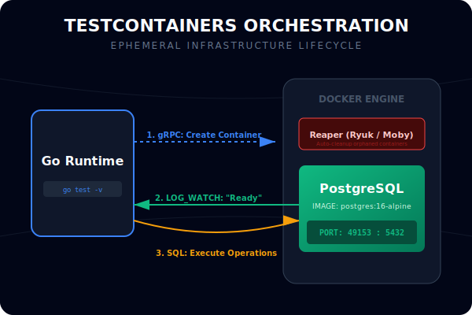
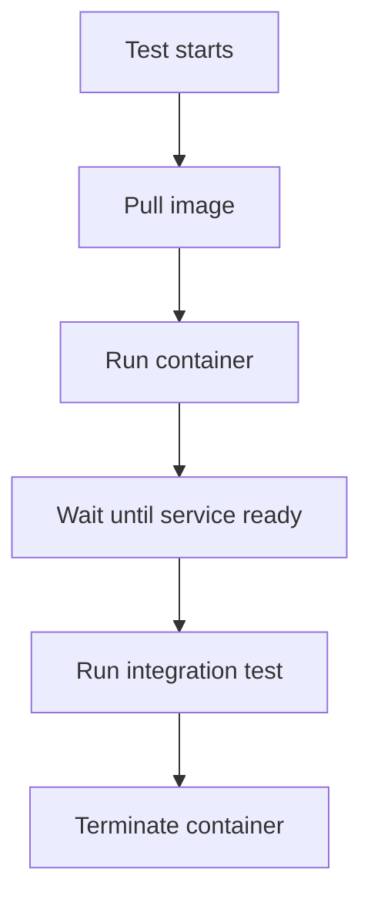

# CH-03: Testcontainers and Real Databases

## 1. Tahap 1: Source Alignment dan Judul

- **Source Link**: [testcontainers-go](https://pkg.go.dev/github.com/testcontainers/testcontainers-go) | [Go Blog: Testing Techniques](https://go.dev/blog/subtests)
- **Framing**: Ada titik di mana mock tidak cukup lagi. Saat perilaku asli database atau service eksternal perlu diuji, container ephemeral menjadi alat yang jauh lebih jujur.

## 2. Tahap 2: Konsep dan Rasionalitas

### Definisi
Testcontainers adalah pendekatan integration testing yang menjalankan dependency nyata, seperti PostgreSQL atau Redis, di dalam container sementara selama test berlangsung.

### Rasionalitas
Pola ini dipilih karena:

1. **Perilaku sistem nyata bisa diuji**  
   Constraint database, error koneksi, dan perilaku driver tidak selalu bisa direpresentasikan dengan mock.
2. **Isolasi tetap terjaga**  
   Container dibuat khusus untuk test dan dibersihkan setelah selesai.
3. **Confidence integration lebih tinggi**  
   Test memverifikasi interaksi nyata antar komponen, bukan hanya kontrak tiruan.

### Analogi Model Mental
Bayangkan latihan penerbangan. Mock seperti simulator kokpit untuk menguji prosedur logika. Testcontainers seperti pesawat latihan sungguhan di landasan kecil: lebih mahal, tetapi memberi keyakinan yang jauh lebih realistis untuk skenario tertentu.

### Terminologi Teknis
- **Ephemeral Infrastructure**: infrastruktur sementara yang hanya hidup selama test.
- **Wait Strategy**: strategi untuk memastikan service di dalam container sudah siap dipakai.
- **Integration Test**: pengujian yang memverifikasi interaksi nyata antar komponen.

## 3. Tahap 3: Visualisasi Sistem

## 4. Tahap 4: Mekanisme Pembuktian

Library testcontainers berkomunikasi dengan Docker untuk menyalakan container, memetakan port, dan menunggu service siap. Setelah itu, test menggunakan dependency nyata yang berjalan dalam lingkungan terisolasi, lalu menutupnya kembali saat test selesai.

Nilai evolusinya untuk `RAK-03`:
- engineer bisa memilih kapan mock cukup dan kapan integrasi nyata dibutuhkan;
- reliability test meningkat karena perilaku eksternal benar-benar disentuh;
- testing modern di Go bergerak dari sekadar unit ke confidence yang lebih luas.

## 5. Tahap 5: Lab Praktis

Lihat contoh integration test di folder [examples/](./examples):
- [01-postgres-integration](./examples/01-postgres-integration) - Setup container PostgreSQL ephemeral untuk menguji repository layer.

---
*Status: [x] Complete*
