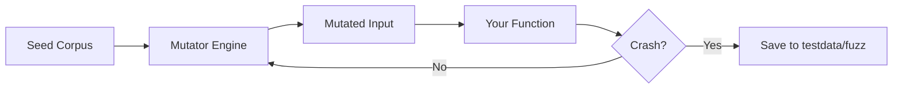

# [BK-03-CH-01] Fuzz Testing

**Breaking Your Logic With Random Data**
*Target: Memahami cara menggunakan native fuzzer Go untuk menemukan bug tersembunyi dalam waktu < 4 menit.*

## 1. Definisi & Konsep (The Logic)

**Fuzz Testing** (atau Fuzzing) adalah teknik pengujian otomatis yang memberikan input acak, ter-mutasi, dan tidak terduga ke dalam fungsi Anda untuk mencari crash, panic, atau kegagalan logika. Sejak Go 1.18, Fuzzing telah menjadi bagian integral dari toolchain standar Go.

### Terminologi Utama (Senior Terms)
- **Seed Corpus**: Kumpulan input awal yang valid yang diberikan oleh developer sebagai panduan bagi fuzzer.
- **Mutator**: Mesin di dalam Go yang mengubah (mutasi) input bit-demi-bit untuk mengeksplorasi jalur kode baru.
- **Fuzzing Engine**: Proses yang berjalan terus-menerus mencoba ribuan kombinasi input hingga menemukan "Counter-example" (input yang menyebabkan kegagalan).

## 2. Rasionalitas (Why & How?)

Mengapa butuh Fuzzing jika sudah ada Unit Test?
- **Human Bias**: Developer cenderung menulis test case untuk input yang mereka *pikirkan*. Fuzzer mencoba input yang *tidak pernah* Anda pikirkan (misal: string dengan karakter null, integer overflow, dsb).
- **Security**: Fuzzing sangat efektif untuk menemukan celah keamanan seperti *buffer overflow* atau *SQL Injection* pada parser.

### Mekanisme Kerja Under-the-Hood
1. Anda menulis fungsi `FuzzXxx(f *testing.F)`.
2. Anda menambahkan seed: `f.Add("input awal")`.
3. Anda memanggil `f.Fuzz(func(t *testing.T, data string) { ... })`.
4. Go akan menjalankan fungsi tersebut secara paralel dengan ribuan input hasil mutasi.
5. Jika gagal, Go akan menyimpan input penyebab gagal tersebut ke dalam folder `testdata/fuzz` agar Anda bisa memperbaikinya dan menjadikannya unit test permanen.

## 3. Implementasi Utama (The Lab)

Lihat teknik stres-tes otomatis di [examples/](./examples/).
1. `01-reverse-fuzz`: Mencari bug pada fungsi pembalik string menggunakan data acak.

## 4. Model Mental Visual (The Assets)

### Fuzzing Feedback Loop

---
*Back to [BK-03 Page](../README.md)*
