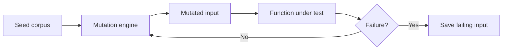

# CH-01: Fuzz Testing

## 1. Tahap 1: Source Alignment dan Judul

- **Source Link**: [Go Fuzzing Documentation](https://go.dev/doc/fuzz/) | [testing package](https://pkg.go.dev/testing)
- **Framing**: Fuzz testing membantu kita keluar dari bias test case buatan manusia dengan mendorong fungsi menerima input yang aneh, agresif, dan tidak terduga.

## 2. Tahap 2: Konsep dan Rasionalitas

### Definisi
Fuzz testing adalah teknik pengujian otomatis yang menjalankan fungsi terhadap banyak input hasil mutasi untuk menemukan panic, crash, atau pelanggaran properti yang seharusnya tetap benar.

### Rasionalitas
Pola ini dipilih karena:

1. **Edge case lebih mudah ditemukan**  
   Input yang tidak terpikir oleh penulis test bisa tetap dicoba oleh fuzzer.
2. **Robustness meningkat**  
   Fungsi tidak hanya diuji pada jalur normal, tetapi juga pada variasi data yang jauh lebih liar.
3. **Toolchain Go mendukung langsung**  
   Fuzzing menjadi bagian alami dari workflow testing, bukan alat terpisah.

### Analogi Model Mental
Bayangkan alat stres-tes untuk produk pabrik. Produk tidak hanya diuji dalam kondisi ideal, tetapi juga didorong ke kondisi yang aneh untuk melihat di mana ia retak.

### Terminologi Teknis
- **Seed Corpus**: kumpulan input awal yang diberikan ke fuzzer.
- **Mutator**: mesin yang memodifikasi input untuk membuka jalur perilaku baru.
- **Counterexample**: input yang memicu kegagalan dan menjadi bukti bug.

## 3. Tahap 3: Visualisasi Sistem

## 4. Tahap 4: Mekanisme Pembuktian

Di Go, fuzzer berjalan lewat fungsi `FuzzXxx` dan memakai seed corpus sebagai titik awal. Input kemudian dimodifikasi untuk mengejar jalur eksekusi baru. Jika ditemukan kegagalan, input itu disimpan agar bisa direproduksi dan dijadikan regression test.

Nilai evolusinya untuk `RAK-03`:
- reliability tidak hanya bergantung pada test case yang dibayangkan developer;
- bug yang tersembunyi di input aneh lebih mudah muncul;
- confidence terhadap parser, transformasi data, dan fungsi sensitif input meningkat.

## 5. Tahap 5: Lab Praktis

Lihat pembuktian fuzzing di folder [examples/](./examples):
- [01-reverse-fuzz](./examples/01-reverse-fuzz) - Fuzz test sederhana untuk fungsi pembalik string.

---
*Status: [x] Complete*
