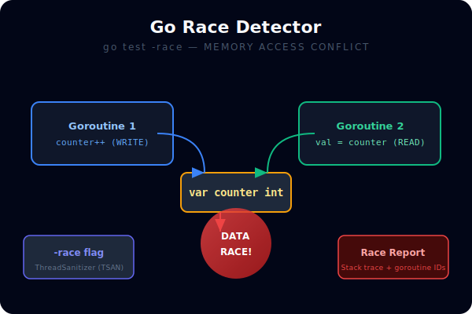
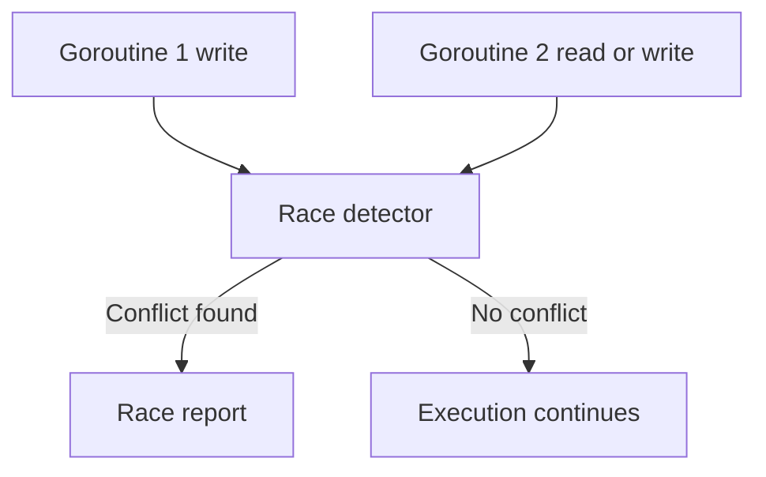

# CH-02: Race Detection

## 1. Tahap 1: Source Alignment dan Judul

- **Source Link**: [Data Race Detector](https://go.dev/doc/articles/race_detector) | [go test](https://pkg.go.dev/cmd/go#hdr-Test_packages)
- **Framing**: Pada kode konkuren, bug paling berbahaya sering tidak langsung crash. Race detector penting karena ia membantu menemukan konflik akses memory yang sulit dilihat dengan mata biasa.

## 2. Tahap 2: Konsep dan Rasionalitas

### Definisi
Race detection adalah proses mendeteksi data race, yaitu kondisi ketika beberapa goroutine mengakses memory yang sama secara bersamaan dan setidaknya salah satunya menulis tanpa sinkronisasi yang benar.

### Rasionalitas
Pola ini dipilih karena:

1. **Bug konkuren jadi lebih terlihat**  
   Banyak data race bersifat non-deterministik dan sulit direproduksi tanpa bantuan tool.
2. **Keamanan kode meningkat**  
   Konflik akses memory bisa ditemukan sebelum berubah jadi korupsi data di produksi.
3. **Toolchain memberi dukungan langsung**  
   Go menyediakan mode `-race` sebagai bagian dari workflow build dan test.

### Analogi Model Mental
Bayangkan dua petugas menulis pada papan yang sama secara bersamaan tanpa koordinasi. Kadang hasil tulisannya tampak benar, kadang kacau. Race detector berfungsi seperti kamera pengawas yang menunjukkan kapan dua tangan itu saling tabrakan.

### Terminologi Teknis
- **Data Race**: konflik baca/tulis atau tulis/tulis tanpa sinkronisasi yang benar.
- **Instrumentation**: penyisipan pemeriksaan tambahan saat program dikompilasi dengan `-race`.
- **Thread Sanitizer**: teknologi dasar yang dipakai untuk mendeteksi konflik akses.

## 3. Tahap 3: Visualisasi Sistem

## 4. Tahap 4: Mekanisme Pembuktian

Saat program dibangun atau diuji dengan `-race`, compiler menambahkan instrumentasi pada akses memory. Selama program berjalan, runtime dan race detector melacak pola akses dari berbagai goroutine. Jika ada konflik tanpa sinkronisasi yang sah, tool akan mengeluarkan laporan dengan stack trace terkait.

Nilai evolusinya untuk `RAK-03`:
- testing tidak berhenti di validasi output, tetapi juga memeriksa keamanan perilaku konkuren;
- bug yang diam-diam merusak state bisa dideteksi lebih awal;
- confidence terhadap kode concurrency meningkat dengan biaya workflow yang masih masuk akal.

## 5. Tahap 5: Lab Praktis

Lihat pembuktian di folder [examples/](./examples):
- [01-unsafe-counter](./examples/01-unsafe-counter) - Simulasi counter tidak aman yang bisa dideteksi dengan race detector.

---
*Status: [x] Complete*
