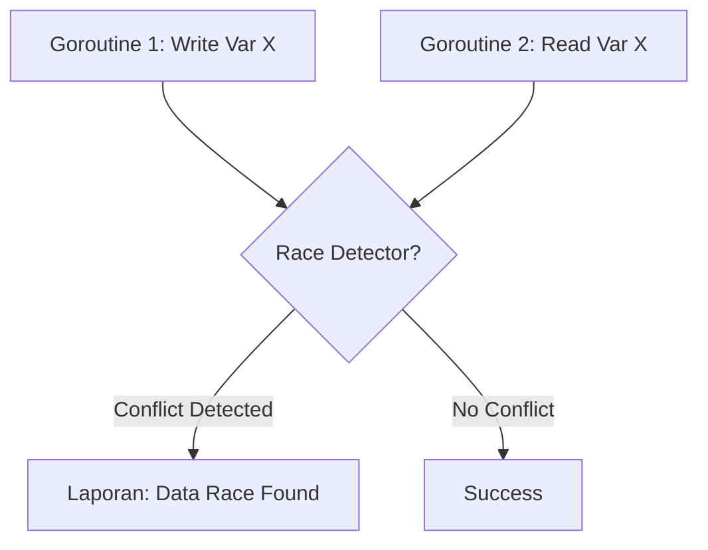

# [BK-03-CH-02] Race Detection

**Finding Data Races in Concurrent Code**
*Target: Memahami cara menggunakan native race detector Go untuk menjamin keamanan konkurensi dalam waktu < 3 menit.*

## 1. Definisi & Konsep (The Logic)

**Data Race** terjadi ketika dua goroutine mengakses variabel yang sama secara bersamaan, dan setidaknya salah satu akses tersebut adalah operasi tulis. Go menyertakan **Race Detector** yang bisa diaktifkan dengan flag `-race` pada saat build, test, atau run.

### Terminologi Utama (Senior Terms)
- **`-race` flag**: Opsi compiler untuk menyisipkan instruksi inspeksi pada setiap akses memory.
- **Race Condition**: Bug non-deterministik yang sangat sulit ditemukan tanpa bantuan tool khusus.
- **Thread Sanitizer (TSAN)**: Teknologi di balik layar yang digunakan Go untuk mendeteksi konflik akses.

## 2. Rasionalitas (Why & How?)

Mengapa butuh Race Detector?
- **Silent Failures**: Data race seringkali tidak menyebabkan crash saat itu juga, tapi menghasilkan data yang salah atau korup secara perlahan.
- **Production Safety**: Menemukan bug konkurensi di lingkungan development jauh lebih murah daripada di production.

### Mekanisme Kerja Under-the-Hood
1. Compiler menyetel *instrumentasi* pada setiap akses variabel.
2. Saat program berjalan, Race Detector mencatat state baca/tulis tiap goroutine.
3. Jika ditemukan akses yang tumpang tindih tanpa sinkronisasi (seperti Mutex), Go akan mencetak laporan lengkap beserta stack trace goroutine yang terlibat.

## 3. Implementasi Utama (The Lab)

Lihat deteksi bug konkuren di [examples/](./examples/).
1. `01-unsafe-counter`: Simulasi counter yang tidak aman dan cara mendeteksinya dengan `-race`.

## 4. Model Mental Visual (The Assets)

### Race Detection Flow

---
*Back to [BK-03 Page](../README.md)*
