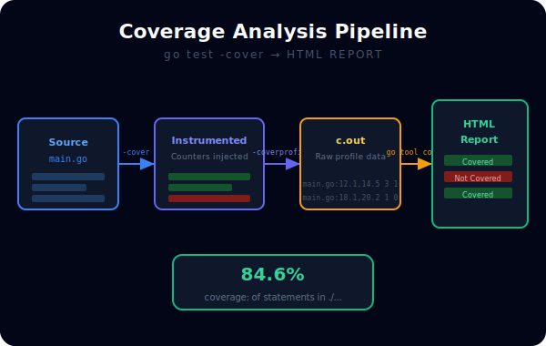
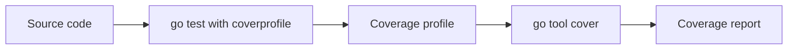

# CH-03: Coverage Analysis

## 1. Tahap 1: Source Alignment dan Judul

- **Source Link**: [Cover story](https://go.dev/blog/cover) | [go tool cover](https://pkg.go.dev/cmd/cover)
- **Framing**: Coverage membantu melihat bagian kode mana yang benar-benar tersentuh oleh test, tetapi ia harus dibaca sebagai alat diagnosis, bukan angka sakral.

## 2. Tahap 2: Konsep dan Rasionalitas

### Definisi
Coverage analysis adalah pengukuran seberapa banyak blok atau statement kode yang dieksekusi saat suite test dijalankan.

### Rasionalitas
Pola ini dipilih karena:

1. **Gap pengujian lebih mudah ditemukan**  
   Jalur error atau cabang logika yang tidak pernah disentuh bisa terlihat lebih cepat.
2. **Perubahan suite test bisa dipantau**  
   Coverage memberi sinyal apakah perluasan test benar-benar menjangkau bagian kode baru.
3. **Visualisasi membantu review**  
   Laporan HTML memudahkan pembaca melihat area mana yang masih kosong.

### Analogi Model Mental
Bayangkan peta bangunan yang diberi warna pada ruangan yang sudah diperiksa tim audit. Coverage tidak menjamin isi ruangan itu benar, tetapi ia memberi tahu ruangan mana yang belum pernah dilihat sama sekali.

### Terminologi Teknis
- **Statement Coverage**: persentase statement yang dijalankan.
- **Coverage Profile**: file hasil yang menyimpan data coverage mentah.
- **`go tool cover`**: alat untuk membaca dan memvisualisasikan coverage profile.

## 3. Tahap 3: Visualisasi Sistem

## 4. Tahap 4: Mekanisme Pembuktian

Saat coverage diaktifkan, compiler menambahkan counter pada blok kode tertentu. Setelah test selesai, counter itu dikumpulkan menjadi profile. Dari sana, toolchain bisa menghitung persentase cakupan dan menampilkan laporan visual.

Yang penting untuk `RAK-03`:
- coverage adalah alat untuk menemukan blind spot;
- angka tinggi tidak otomatis berarti test berkualitas tinggi;
- nilainya paling kuat saat dipakai bersama pembacaan kritis terhadap jalur logika yang penting.

## 5. Tahap 5: Lab Praktis

Lihat pembuktian coverage di folder [examples/](./examples):
- [01-visual-coverage](./examples/01-visual-coverage) - Panduan menghasilkan dan membaca laporan coverage HTML.

---
*Status: [x] Complete*
