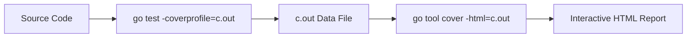

# [BK-03-CH-03] Coverage Analysis & Enforcement

**Measuring Test Quality, Not Just Quantity**
*Target: Memahami cara mengukur seberapa jauh pengujian Anda melindungi kode dalam waktu < 4 menit.*

## 1. Definisi & Konsep (The Logic)

**Code Coverage** adalah metrik yang menunjukkan persentase baris kode (atau blok kode) yang dieksekusi selama pengujian dijalankan. Go memiliki dukungan native untuk menghitung dan memvisualisasikan data ini tanpa perlu library eksternal.

### Terminologi Utama (Senior Terms)
- **Statement Coverage**: Persentase pernyataan (statements) yang dijalankan.
- **Coverage Profile**: File output (biasanya `.out`) yang berisi data mentah eksekusi kode setiap baris.
- **`go tool cover`**: Alat bantu untuk mengubah profile mentah menjadi visualisasi HTML yang interaktif.

## 2. Rasionalitas (Why & How?)

Mengapa coverage itu penting tapi bisa menipu?
- **Gap Identification**: Membantu menemukan jalur kode (misal: penanganan error tertentu) yang ternyata belum pernah diuji sama sekali.
- **The Myth of 100%**: Coverage tinggi tidak menjamin kode bebas bug. Ia hanya menjamin kode tersebut *pernah dijalankan*. Logika yang salah tetap bisa memiliki coverage 100%.

### Mekanisme Kerja Under-the-Hood
1. Saat `-cover` aktif, Go compiler menyisipkan "counter" pada tiap blok kode.
2. Setiap kali blok dijalankan, counter bertambah.
3. Di akhir pengujian, Go menghitung (Blok Terjamah / Total Blok) * 100%.
4. Dengan `-coverprofile`, Go mencatat koordinat file/baris mana saja yang terjamah.

## 3. Implementasi Utama (The Lab)

Lihat cara visualisasi coverage di [examples/](./examples/).
1. `01-visual-coverage`: Panduan langkah-demi-langkah menghasilkan laporan HTML berwarna.

## 4. Model Mental Visual (The Assets)

### Coverage Pipeline

---
*Back to [BK-03 Page](../README.md)*
