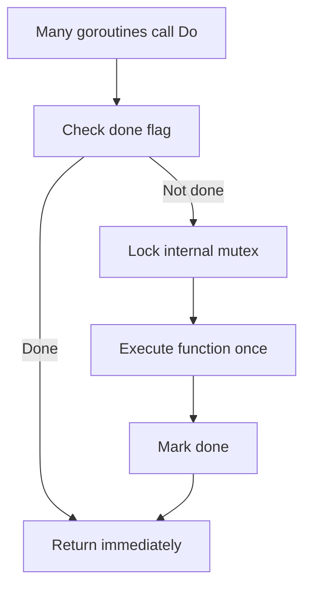

# CH-01: `sync.Once` and `sync.OnceFunc`

## 1. Tahap 1: Source Alignment dan Judul

- **Source Link**: [sync package](https://pkg.go.dev/sync) | [Go 1.21 Release Notes](https://go.dev/doc/go1.21)
- **Framing**: `sync.Once` penting saat ada inisialisasi yang harus aman terhadap race, tetapi tetap ingin ditunda sampai benar-benar dibutuhkan.

## 2. Tahap 2: Konsep dan Rasionalitas

### Definisi
`sync.Once` adalah primitif sinkronisasi yang menjamin sebuah fungsi hanya dieksekusi satu kali, tidak peduli berapa banyak goroutine yang memanggilnya. Go modern juga menyediakan helper seperti `sync.OnceFunc` untuk pola yang lebih ringkas.

### Rasionalitas
Pola ini dipilih karena:

1. **Inisialisasi lazy jadi aman**  
   Banyak goroutine bisa memanggil entry point yang sama tanpa memicu inisialisasi ganda.
2. **Race condition dapat dihindari**  
   Engineer tidak perlu membuat flag manual yang rawan salah sinkronisasi.
3. **Biaya startup bisa ditekan**  
   Resource hanya diinisialisasi saat memang pertama kali dibutuhkan.

### Analogi Model Mental
Bayangkan saklar utama generator cadangan. Banyak petugas bisa berlari ke panel kontrol saat listrik mati, tetapi sistem memastikan generator hanya dinyalakan sekali, bukan berkali-kali oleh orang yang berbeda.

### Terminologi Teknis
- **Lazy Initialization**: menunda pembuatan resource sampai saat pertama kali dipakai.
- **Fast Path**: jalur cepat saat eksekusi sekali sudah selesai.
- **Closure Wrapper**: pembungkusan fungsi agar tetap memegang kontrak "sekali jalan".

## 3. Tahap 3: Visualisasi Sistem

## 4. Tahap 4: Mekanisme Pembuktian

Secara umum, `sync.Once` memakai pemeriksaan cepat untuk kasus yang sudah selesai, lalu jatuh ke jalur sinkronisasi yang lebih lambat jika fungsi belum pernah dijalankan. Dengan model ini, biaya koordinasi tinggi hanya dibayar saat benar-benar diperlukan.

Nilai concurrency-nya untuk `RAK-03`:
- lazy initialization jadi primitive yang aman;
- dependency global tertentu bisa dipersiapkan tanpa race;
- engineer punya alat resmi untuk menggantikan pola flag manual yang rapuh.

## 5. Tahap 5: Lab Praktis

Lihat pembuktian di folder [examples/](./examples):
- [01-lazy-init](./examples/01-lazy-init) - Contoh inisialisasi sekali dengan `sync.Once`.
- [02-oncefunc](./examples/02-oncefunc) - Contoh wrapper yang memanfaatkan helper baru seperti `sync.OnceFunc`.

---
*Status: [x] Complete*
