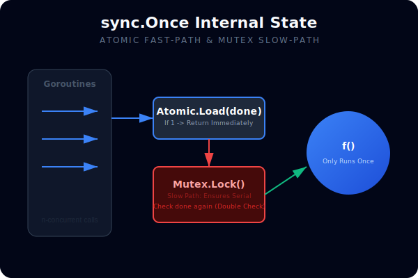
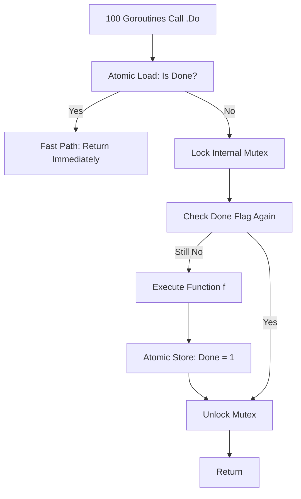

# [BK-01-CH-01] sync.Once & sync.OnceFunc

**Thread-Safe One-Time Execution**
*Target: Memahami cara inisialisasi lazy yang aman dan efisien dalam waktu < 4 menit.*

## 1. Definisi & Konsep (The Logic)

**`sync.Once`** adalah primitif sinkronisasi yang menjamin sebuah fungsi hanya dieksekusi tepat satu kali, tidak peduli berapa banyak goroutine yang memanggilnya. Ini sangat vital untuk pola *Lazy Initialization* (singleton, load config, setup connection).

Sejak Go 1.21, diperkenalkan **`sync.OnceFunc`**, **`sync.OnceValue`**, dan **`sync.OnceValues`** yang merupakan *wrapper* modern untuk menyederhanakan penggunaan `sync.Once` dengan nilai kembalian (return values).

### Terminologi Utama (Senior Terms)
- **Lazy Initialization**: Menunda pembuatan objek/koneksi hingga saat pertama kali dibutuhkan.
- **Double-Checked Locking**: Pola manual (biasanya salah di Go) yang sekarang digantikan secara otomatis oleh `sync.Once`.
- **Closure Wrapping**: Teknik membungkus fungsi asli ke dalam fungsi yang hanya bisa dijalankan sekali.

## 2. Rasionalitas (Why & How?)

Mengapa menggunakan `sync.Once` daripada `init()` atau flag boolean manual?
- **Concurrent Safety**: Jika 100 goroutine mencoba melakukan `init` secara bersamaan, `sync.Once` menjamin hanya satu yang jalan, sementara yang lain *blocking* hingga inisialisasi selesai.
- **Resource Efficiency**: Berbeda dengan fungsi `init()` yang jalan saat startup, `sync.Once` hanya memakan resource saat benar-benar dipanggil.
- **Idiomatic**: Menghindari perlombaan data (Race Condition) pada variabel status global.

### Mekanisme Kerja Under-the-Hood
1. `sync.Once` menggunakan `atomic` load pada sebuah counter (done flag).
2. Jika flag sudah 1, ia langsung return (fast path).
3. Jika flag 0, ia akan menggunakan `Mutex` internal untuk memastikan hanya satu goroutine yang mengeksekusi fungsi tersebut (slow path).
4. Setelah fungsi selesai, flag diubah menjadi 1 menggunakan `atomic.Store`.

## 3. Implementasi Utama (The Lab)

Lihat pola inisialisasi yang benar di [examples/](./examples/).
1. `01-lazy-init`: Menggunakan `sync.Once` untuk singleton database connection.
2. `02-oncefunc`: Menggunakan fitur Go 1.21+ untuk membungkus fungsi log yang hanya boleh muncul sekali.

## 4. Model Mental Visual (The Assets)

### sync.Once Execution Logic

---
*Back to [SR-03 Page](../README.md)*
