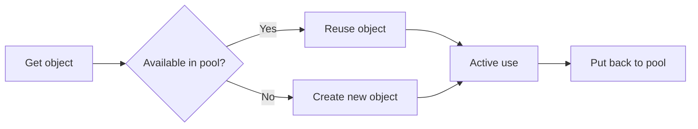

# CH-02: `sync.Pool`

## 1. Tahap 1: Source Alignment dan Judul

- **Source Link**: [sync package](https://pkg.go.dev/sync) | [Go Optimization Guide: Object Pooling](https://go.dev/doc)
- **Framing**: `sync.Pool` menarik saat biaya alokasi objek kecil mulai terasa, tetapi kita masih ingin membiarkan runtime mengelola hidup-mati objek secara fleksibel.

## 2. Tahap 2: Konsep dan Rasionalitas

### Definisi
`sync.Pool` adalah cache objek sementara yang thread-safe untuk membantu penggunaan ulang objek tertentu dan mengurangi tekanan alokasi berulang.

### Rasionalitas
Pola ini dipilih karena:

1. **Tekanan GC bisa dikurangi**  
   Objek sementara tidak selalu perlu dialokasikan dari nol setiap kali dipakai.
2. **Throughput aplikasi bisa meningkat**  
   Pada jalur panas, reuse objek tertentu dapat menurunkan biaya alokasi.
3. **Pola reuse tetap sederhana**  
   Engineer mendapat primitive reuse tanpa harus membangun pool manual yang kompleks.

### Analogi Model Mental
Bayangkan troli belanja di supermarket. Setelah selesai dipakai, troli dikembalikan ke area bersama untuk digunakan pembeli berikutnya. Namun supermarket tidak menjamin troli tertentu akan selalu tersedia persis di tempat yang sama.

### Terminologi Teknis
- **GC Pressure**: tekanan kerja garbage collector karena alokasi yang sering.
- **Object Reuse**: penggunaan kembali objek yang sudah pernah dibuat.
- **Pool Eviction**: objek di pool bisa dibersihkan oleh runtime saat dianggap perlu.

## 3. Tahap 3: Visualisasi Sistem

## 4. Tahap 4: Mekanisme Pembuktian

`sync.Pool` tidak menjanjikan persistensi objek seperti cache permanen. Runtime bebas membuang isinya, terutama saat GC, sehingga pool lebih cocok untuk objek sementara yang murah dibuat ulang tetapi cukup sering dialokasikan.

Nilai concurrency-nya untuk `RAK-03`:
- engineer bisa mengurangi biaya alokasi di jalur panas tertentu;
- object reuse tetap berada dalam kendali primitive standar, bukan pool ad-hoc;
- keputusan optimasi memori menjadi lebih eksplisit.

## 5. Tahap 5: Lab Praktis

Lihat pembuktian di folder [examples/](./examples):
- [01-pool-perf](./examples/01-pool-perf) - Eksperimen penggunaan ulang objek dengan `sync.Pool`.

---
*Status: [x] Complete*
