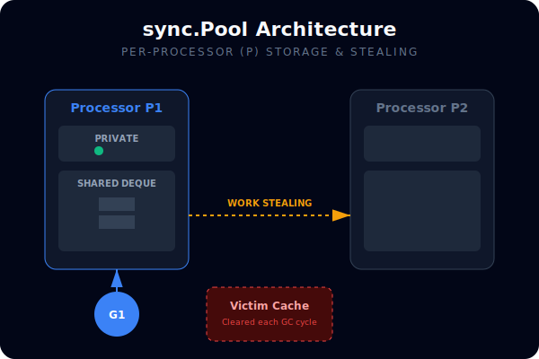
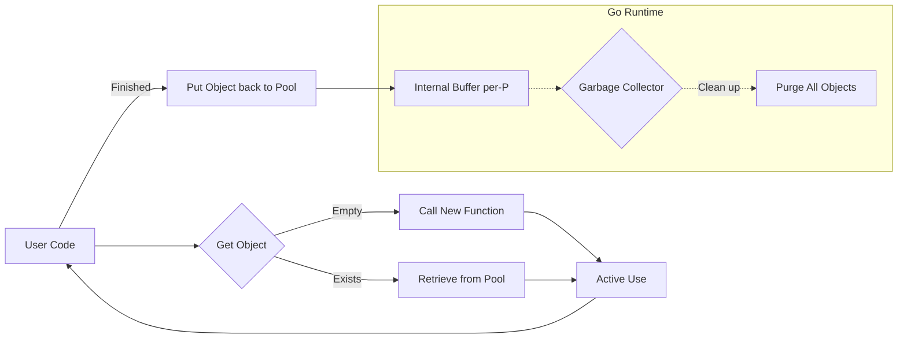

# [BK-01-CH-02] sync.Pool

**Fighting Garbage Collector Pressure**
*Target: Memahami cara penggunaan kembali objek (object reuse) untuk optimasi memori dalam waktu < 4 menit.*

## 1. Definisi & Konsep (The Logic)

**`sync.Pool`** adalah cache objek sementara yang bersifat thread-safe. Tujuannya adalah untuk menyimpan objek yang sudah dialokasikan tetapi sudah tidak digunakan, sehingga dapat digunakan kembali oleh goroutine lain di masa depan daripada dibuang ke Garbage Collector (GC).

### Terminologi Utama (Senior Terms)
- **GC Pressure**: Beban kerja Garbage Collector dalam membersihkan memori yang dialokasikan secara terus menerus.
- **Victim Cache**: Objek di dalam pool yang akan dihapus secara otomatis oleh runtime saat siklus GC berjalan (Pool tidak menjamin persistensi).
- **False Sharing**: Masalah performa CPU cache yang diminimalisir oleh implementasi internal `sync.Pool` menggunakan *per-P (Processor) storage*.

## 2. Rasionalitas (Why & How?)

Kapan harus menggunakan `sync.Pool`?
- **High Frequency Allocation**: Jika Anda membuat jutaan objek kecil (seperti `bytes.Buffer` atau struct temporer) per detik.
- **Throughput over Latency**: Untuk aplikasi API atau pemrosesan paket data di mana overhead alokasi memori menjadi bottleneck.

**Peringatan Senior**: Jangan gunakan `sync.Pool` untuk objek yang memegang status penting (seperti koneksi database yang harus di-close manual) karena objek bisa hilang kapan saja saat GC.

### Mekanisme Kerja Under-the-Hood
1. Go mendistribusikan Pool ke setiap P (Processor) untuk menghindari lock contention.
2. Saat `Put(x)`, objek masuk ke `private` storage atau `shared` storage milik P tersebut.
3. Saat `Get()`, Go mencoba mengambil dari `private` P lokal, lalu mencuri dari P lain, baru terakhir memanggil fungsi `New` jika semua kosong.
4. **Siklus GC**: Pool dibersihkan setiap kali GC berjalan untuk mencegah kebocoran memori (memory leak).

## 3. Implementasi Utama (The Lab)

Lihat perbedaan performa nyata di [examples/](./examples/).
1. `01-pool-perf`: Benchmark perbandingan antara alokasi baru vs penggunaan kembali via `sync.Pool`.

## 4. Model Mental Visual (The Assets)

### sync.Pool Lifecycle & GC Interaction

---
*Back to [SR-03 Page](../README.md)*
