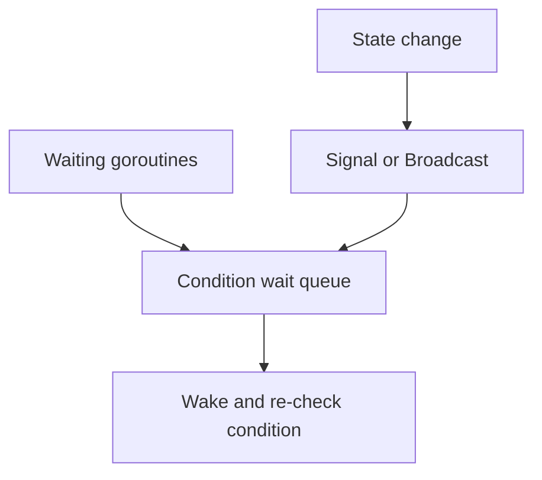

# CH-03: Semaphores and `sync.Cond`

## 1. Tahap 1: Source Alignment dan Judul

- **Source Link**: [sync package](https://pkg.go.dev/sync) | [x/sync/semaphore](https://pkg.go.dev/golang.org/x/sync/semaphore)
- **Framing**: Saat kita perlu menunggu kondisi tertentu atau membatasi jumlah worker aktif, channel tidak selalu menjadi alat yang paling jelas. Di situlah `sync.Cond` dan semaphore mulai relevan.

## 2. Tahap 2: Konsep dan Rasionalitas

### Definisi
`sync.Cond` adalah primitive signaling berbasis kondisi bersama, sedangkan semaphore adalah mekanisme untuk membatasi jumlah pemakai aktif terhadap resource tertentu.

### Rasionalitas
Pola ini dipilih karena:

1. **Signaling kompleks lebih mudah dimodelkan**  
   `sync.Cond` cocok saat goroutine menunggu perubahan state tertentu, bukan transfer data.
2. **Pembatasan resource lebih eksplisit**  
   Semaphore memudahkan kita mengatakan "hanya N pekerjaan yang boleh aktif bersamaan".
3. **Koordinasi bisa dipisah dari payload**  
   Tidak semua masalah concurrency perlu membawa data lewat channel.

### Analogi Model Mental
Bayangkan ruang rapat dengan kapasitas terbatas. Semaphore adalah petugas pintu yang memastikan hanya sejumlah orang tertentu yang boleh masuk. `sync.Cond` seperti papan pengumuman yang membangunkan semua orang saat status ruangan berubah.

### Terminologi Teknis
- **Signal**: membangunkan satu goroutine yang menunggu.
- **Broadcast**: membangunkan semua goroutine yang menunggu kondisi yang sama.
- **Wait Queue**: antrean goroutine yang sedang menunggu perubahan kondisi.

## 3. Tahap 3: Visualisasi Sistem

## 4. Tahap 4: Mekanisme Pembuktian

`sync.Cond` bekerja di atas lock bersama. Goroutine akan menunggu sambil melepas lock, lalu saat dibangunkan ia mengambil lock lagi untuk memeriksa kondisi yang relevan. Semaphore, di sisi lain, bekerja sebagai kuota untuk membatasi concurrency aktif terhadap resource atau pekerjaan tertentu.

Nilai concurrency-nya untuk `RAK-03`:
- engineer punya opsi koordinasi selain channel;
- antrean tunggu dan pembatasan resource bisa dimodelkan lebih eksplisit;
- pola concurrent jadi lebih cocok untuk kebutuhan produksi yang kompleks.

## 5. Tahap 5: Lab Praktis

Lihat pembuktian koordinasi di folder [examples/](./examples):
- [01-cond-signal](./examples/01-cond-signal) - Simulasi signaling berbasis kondisi menggunakan `sync.Cond`.

---
*Status: [x] Complete*
