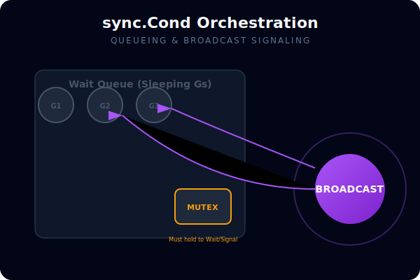
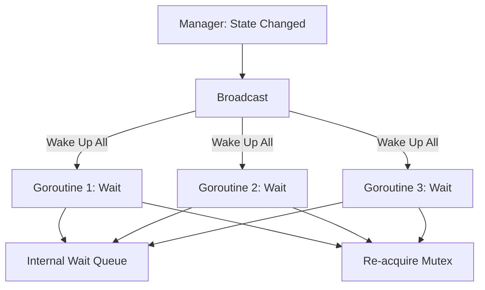

# [BK-01-CH-03] Semaphores & sync.Cond

**Advanced Signaling & Resource Orchestration**
*Target: Memahami koordinasi antar goroutine yang kompleks dalam waktu < 4 menit.*

## 1. Definisi & Konsep (The Logic)

**`sync.Cond`** (Condition Variable) adalah primitif sinkronisasi untuk titik temu goroutine yang menunggu atau mengumumkan terjadinya suatu peristiwa/kondisi tertentu. Berbeda dengan channel yang digunakan untuk transfer data, `sync.Cond` murni digunakan untuk **signaling**.

**Semaphores** (biasanya diimplementasikan via `golang.org/x/sync/semaphore`) adalah cara untuk membatasi akses ke sumber daya yang jumlahnya terbatas (misal: hanya boleh 10 koneksi database aktif).

### Terminologi Utama (Senior Terms)
- **Signal**: Membangunkan satu goroutine yang sedang menunggu.
- **Broadcast**: Membangunkan **semua** goroutine yang sedang menunggu kondisi yang sama.
- **Wait Queue**: Antrian internal goroutine yang sedang tertidur menunggu sinyal.
- **Spurious Wakeup**: Kondisi di mana goroutine terbangun tanpa sinyal (di Go diminimalisir, tapi tetap harus dicek dalam loop `for`).

## 2. Rasionalitas (Why & How?)

Mengapa tidak pakai Channel saja?
- **Fan-out Signaling**: Mengirim sinyal ke banyak penerima sekaligus (Broadcast) lebih efisien dengan `sync.Cond` daripada menutup banyak channel.
- **State-Dependent Wait**: Jika Anda butuh goroutine menunggu hingga sebuah status variabel kompleks berubah (misal: `queue.length > 5 && queue.isReady`), `sync.Cond` lebih fleksibel.

### Mekanisme Kerja Under-the-Hood
1. `sync.Cond` selalu membutuhkan `Locker` (biasanya `sync.Mutex`).
2. `Wait()`: Melepaskan lock, menidurkan goroutine, dan memasukkannya ke antrian. Saat bangun, ia otomatis mengambil kembali lock tersebut.
3. `Signal()` / `Broadcast()`: Memindahkan goroutine dari antrian tidur ke antrian 'siap jalan' (runnable).

## 3. Implementasi Utama (The Lab)

Lihat koordinasi event di [examples/](./examples/).
1. `01-cond-signal`: Simulasi sistem antrian di mana banyak worker menunggu status "Ready" dari manager.

## 4. Model Mental Visual (The Assets)

### sync.Cond Wait & Broadcast Flow

---
*Back to [SR-03 Page](../README.md)*
