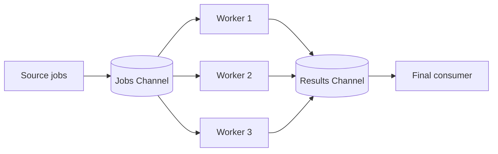

# CH-01: Fan-Out and Fan-In

## 1. Tahap 1: Source Alignment dan Judul

- **Source Link**: [Go Concurrency Patterns: Pipelines and cancellation](https://go.dev/blog/pipelines) | [Effective Go: Channels](https://go.dev/doc/effective_go#channels)
- **Framing**: Fan-out dan fan-in dipakai saat satu aliran kerja perlu dibagi ke banyak worker, lalu hasilnya digabung lagi tanpa kehilangan kontrol terhadap lifecycle goroutine.

## 2. Tahap 2: Konsep dan Rasionalitas

### Definisi
**Fan-out** adalah pola saat satu sumber pekerjaan dikonsumsi banyak worker secara paralel. **Fan-in** adalah pola saat hasil dari banyak worker digabung kembali ke satu aliran hasil.

### Rasionalitas
Pola ini dipilih karena:

1. **Throughput bisa dinaikkan**  
   Beban kerja berat dapat dibagi ke beberapa goroutine tanpa membuat arsitektur jadi acak.
2. **Batas resource lebih mudah dijaga**  
   Jumlah worker dapat dikontrol, jadi sistem tidak asal membuat goroutine atau koneksi terlalu banyak.
3. **Hasil tetap punya jalur konsolidasi yang jelas**  
   Setelah kerja paralel selesai, output tetap kembali ke satu titik konsumsi yang mudah dikelola.

### Analogi Model Mental
Bayangkan satu truk besar membawa banyak paket ke gudang. Paket-paket itu dibagi ke beberapa meja sortir agar prosesnya cepat, lalu semua paket yang sudah diproses dikumpulkan lagi ke satu conveyor sebelum dikirim keluar.

### Terminologi Teknis
- **Worker Pool**: sekumpulan worker yang mengambil job dari channel yang sama.
- **Multiplexing**: penggabungan banyak aliran hasil ke satu output channel.
- **Backpressure**: tekanan saat produsen lebih cepat dari konsumen.

## 3. Tahap 3: Visualisasi Sistem

## 4. Tahap 4: Mekanisme Pembuktian

Di Go, fan-out biasanya lahir secara alami karena banyak goroutine membaca dari channel yang sama. Fan-in biasanya butuh mekanisme penggabungan, misalnya goroutine pengumpul plus `sync.WaitGroup`, agar output channel baru ditutup hanya setelah semua worker selesai.

Nilai praktisnya untuk `RAK-03`:
- concurrency dipakai untuk menaikkan throughput tanpa kehilangan struktur;
- engineer bisa membatasi jumlah worker agar resource tetap aman;
- tahap konsolidasi membuat hasil paralel lebih mudah diolah lebih lanjut.

## 5. Tahap 5: Lab Praktis

Lihat pembuktian di folder [examples/](./examples):
- [01-industrial-worker-pool](./examples/01-industrial-worker-pool) - Pipeline sederhana yang mendistribusikan job ke banyak worker lalu menggabungkan hasilnya kembali.

---
*Status: [x] Complete*
